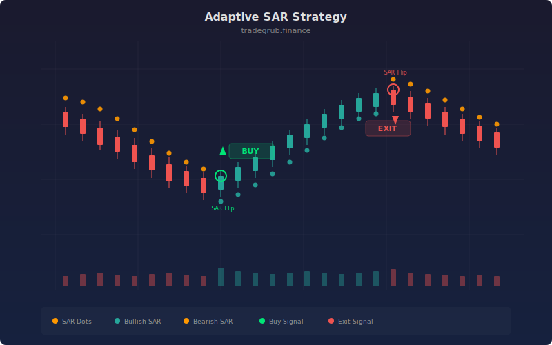

# Adaptive SAR Strategy

Trend-following strategy that builds on the classic Parabolic SAR by making the acceleration factor responsive to current volatility. The maximum AF adjusts based on ATR percentile ranking over a 50-bar window, so the SAR tightens faster in volatile markets and stays looser in calm ones. Entries trigger when price crosses the adaptive SAR, with ATR-based stop losses for risk management.

## Concept

## Parameters

- **AF Start/Max**: Acceleration factor range (default: 0.02 to 0.2)
- **ATR Length**: ATR period for volatility measurement (default: 14)
- **Stop ATR Multiple**: Stop loss distance in ATR units (default: 2.0)

## Signals

- **Long entry**: Price crosses above adaptive SAR
- **Short entry**: Price crosses below adaptive SAR
- **Stops**: ATR-based stop loss
