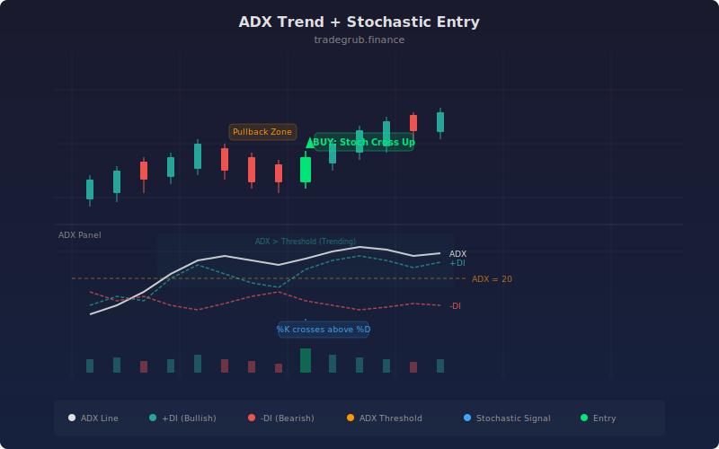

# ADX Trend + Stochastic Entry

The ADX Stochastic strategy combines Welles Wilder's Average Directional Index with George Lane's Stochastic oscillator to solve a fundamental timing problem in trend trading. ADX measures trend strength while the Directional Indicators (+DI and -DI) reveal trend direction, but neither tells you precisely when to enter. The Stochastic oscillator fills that gap by detecting momentum pullbacks within a confirmed trend, giving traders high-probability entries that ride established directional moves rather than chasing breakouts.

## Conceptual Diagram



## How It Works

The strategy operates as a two-layer filter system. The first layer uses the Average Directional Index to determine whether a tradeable trend exists. ADX values above the threshold (default 20) indicate that price is moving directionally rather than chopping sideways. The Directional Indicators (+DI and -DI) then classify the trend as bullish (+DI above -DI) or bearish (-DI above +DI).

The second layer uses the Stochastic oscillator to time entries within the confirmed trend. When the market is in a bullish trend (ADX above threshold, +DI above -DI), the strategy waits for the smoothed %K line to cross above the %D line while %K remains below the overbought level. This crossover signals that a pullback within the uptrend has ended and momentum is resuming upward.

For short entries, the logic mirrors: the market must be in a bearish trend (ADX above threshold, -DI above +DI), and the Stochastic %K must cross below %D while %K remains above the oversold level. This prevents shorting into already-oversold conditions within a downtrend.

The %K smoothing parameter controls how sensitive the Stochastic is to price changes. Higher smoothing values produce fewer but more reliable signals. The %D line is itself a moving average of %K, so the crossover represents a momentum shift confirmed by two levels of smoothing.

All conditions are evaluated as vectorized boolean arrays across the entire price history, and entries are executed in a loop that processes each bar sequentially. This allows the strategy to generate signals on every qualifying bar rather than only the most recent one.

## Parameters

| Parameter | Default | Range | Description |
|-----------|---------|-------|-------------|
| DI Length | 14 | 2-50 | Lookback period for computing +DI and -DI directional indicators |
| ADX Length | 14 | 2-50 | Smoothing period applied to the ADX line itself |
| ADX Threshold | 20 | 10-50 | Minimum ADX value required to confirm a trending market |
| Stochastic Length | 14 | 2-50 | Lookback window for the raw Stochastic %K calculation |
| Stochastic Smoothing | 3 | 1-10 | SMA smoothing applied to %K and then again to produce %D |
| Stochastic Overbought | 80 | 60-95 | Upper level; long entries blocked when %K exceeds this |
| Stochastic Oversold | 20 | 5-40 | Lower level; short entries blocked when %K is below this |

## Python Advantage

This strategy leverages vectorized boolean masking to compute all entry conditions simultaneously across the full dataset, something that requires bar-by-bar evaluation in other scripting languages.

```python
# Vectorized multi-condition masking across entire price history
trending = adx_val > adx_thresh
bullish_trend = trending & (plus_di > minus_di)
bearish_trend = trending & (minus_di > plus_di)

stoch_cross_up = ta.crossover(k_smooth, d_line)
stoch_cross_down = ta.crossunder(k_smooth, d_line)

# Single-expression compound conditions — no nested if/else chains
long_cond = bullish_trend & stoch_cross_up & (k_smooth < stoch_ob)
short_cond = bearish_trend & stoch_cross_down & (k_smooth > stoch_os)
```

The `&` operator performs element-wise AND across numpy arrays, producing a boolean mask for every bar in the dataset at once. This approach is orders of magnitude faster than iterating bar-by-bar and enables backtesting over thousands of bars in milliseconds.

## When to Use

This strategy works best on trending instruments such as large-cap stocks, major forex pairs, and index futures. It excels on 1-hour to daily timeframes where trends develop over multiple sessions. Avoid using it on range-bound or low-volume securities where ADX rarely exceeds the threshold, as the strategy will generate few or no signals.

## Risk Management

Place stops below the most recent swing low for long entries or above the swing high for short entries. The Stochastic levels provide natural invalidation points: if %K reverses back through %D immediately after the entry signal, the momentum thesis is broken. Position sizing should account for the ADX threshold sensitivity: lowering the threshold generates more trades but includes weaker trends with higher failure rates.

## Combining with Other Indicators

- **ATR Trailing Stop**: Use the ATR trailing stop strategy to manage exits dynamically once the ADX-Stochastic entry triggers, rather than relying on fixed stop levels.
- **Bollinger Bands**: Overlay Bollinger Bands to identify whether the Stochastic pullback coincides with a band touch, adding confluence to entries.
- **Choppiness Filter**: Pre-filter with the Choppiness Index to avoid periods where ADX may read above threshold but price action is still erratic.
