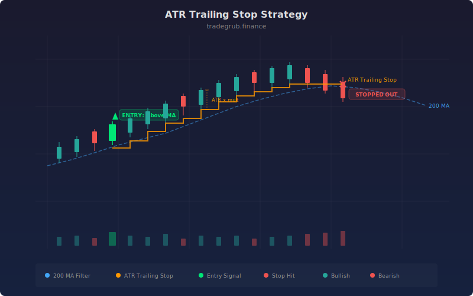

# ATR Trailing Stop

The ATR Trailing Stop strategy uses the Average True Range to set dynamic trailing stop levels that adapt to current market volatility. Developed from the principles of Chuck LeBeau's chandelier exit, it enters trades based on trend direction relative to a long-term moving average, then manages exits using a volatility-adjusted trailing stop. The stop widens during volatile markets and tightens during calm ones, providing intelligent risk management that fixed-point stops cannot match.

## Conceptual Diagram



## How It Works

The strategy establishes trend direction using a simple moving average (default 50 periods). When price is above the SMA, the market is considered to be in an uptrend and the strategy looks for long entries. When price is below the SMA, it shifts to bearish mode and enters short positions.

For long positions, the trailing stop is calculated as the current close minus a multiple of ATR (default 3.0x). The strategy then takes the highest value of this trailing level over the ATR lookback period, creating a ratcheting stop that only moves upward. This means the stop follows price higher during a trend but never drops back down during pullbacks. A long position is entered when price is above the trend SMA and not dangerously close to the trailing stop level (within 2% of it).

For short positions, the trailing stop is the current close plus the ATR multiple. The strategy takes the lowest value of this level over the lookback period, creating a ceiling that only moves downward. Short positions close when price breaks above this descending stop.

The exit mechanism is straightforward: if price closes below the long trailing stop, the long is closed. If price closes above the short trailing stop, the short is closed. This provides automatic profit protection that tightens as the trend matures and ATR contracts.

## Parameters

| Parameter | Default | Range | Description |
|-----------|---------|-------|-------------|
| ATR Length | 14 | 5-50 | Lookback period for the ATR calculation |
| ATR Multiplier | 3.0 | 1.0-10.0 | Multiple of ATR used to offset the trailing stop from price |
| Trend SMA Length | 50 | 10-200 | Moving average period used to determine overall trend direction |

## Python Advantage

The strategy uses numpy array operations and the `ta.highest()` / `ta.lowest()` functions to compute ratcheting trailing stops across the full price history in a single pass.

```python
# Vectorized trailing stop computation across all bars
trail_long = close - atr_mult * atr
trail_short = close + atr_mult * atr

# Ratcheting stop: highest trailing long stop over lookback
# This creates a stop that only rises, never falls
trail_long_stop = ta.highest(trail_long, atr_len)

# Lowest trailing short stop creates a ceiling that only descends
trail_short_stop = ta.lowest(trail_short, atr_len)

# Near-stop detection with percentage threshold
near_stop = close[-1] < trail_long_stop[-1] * 1.02
```

The combination of vectorized arithmetic (`close - atr_mult * atr`) with rolling window functions (`ta.highest`) computes the entire trailing stop history in two lines. Other scripting languages require explicit loops with state variables to track the ratcheting behavior.

## When to Use

Ideal for trending markets on daily and weekly timeframes where trends persist for weeks or months. Works well with large-cap stocks, index ETFs, trending forex pairs, and commodity futures. The wide default multiplier (3.0) is designed for daily charts; reduce to 1.5-2.0 for intraday timeframes. Avoid during range-bound markets where the SMA will generate frequent direction changes.

## Risk Management

The ATR multiplier is the key risk parameter. A multiplier of 3.0 gives the trade substantial room to breathe but increases the potential loss per trade. For tighter risk control, reduce the multiplier to 2.0 but accept more frequent stop-outs during normal retracements. The 2% proximity filter prevents entering long positions right at the stop level, avoiding immediate stop-outs on entry. Always size positions based on the distance between entry price and the current trailing stop.

## Combining with Other Indicators

- **ADX Trend**: Use ADX to confirm trend strength before entering, ensuring the SMA direction signal has genuine momentum behind it.
- **EMA Crossover**: Replace the SMA trend filter with a fast/slow EMA crossover for more responsive trend detection while keeping the ATR trailing stop for exits.
- **Donchian Breakout**: Combine Donchian channel breakouts for entries with ATR trailing stops for exits, replicating an enhanced version of classic turtle trading.
