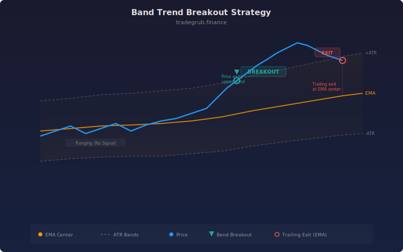

# Band Trend Breakout

Adaptive band breakout strategy that uses an EMA center line with ATR-scaled width to identify trend starts and trail exits.

## Concept

## How It Works

1. A center line is calculated as an EMA of the close price.
2. Upper and lower bands are placed at a configurable ATR multiple above and below the center.
3. When price crosses above the upper band, a long entry is triggered (trend breakout).
4. When price crosses below the lower band, a short entry is triggered (trend breakdown).
5. Exits trail to the center line: longs close when price crosses below center, shorts close when price crosses above center.

The ATR-based width makes the bands adaptive. In volatile markets the bands widen, requiring a stronger move to trigger entry. In quiet markets the bands tighten, catching smaller breakouts.

## Inputs

- **EMA Length**: Period for the center EMA (default 20)
- **ATR Length**: Period for the ATR calculation (default 14)
- **Band Multiplier**: ATR multiple for band width (default 2.0)
- **Show Labels**: Toggle entry and exit labels on the chart (default true)

## Usage Notes

- Higher multiplier values filter out noise but enter later into trends.
- Lower multiplier values catch more breakouts but increase false signals.
- The center-line trailing exit gives trends room to run while protecting against reversals.
- Works on any timeframe and instrument. Adjust the multiplier to suit the asset's volatility profile.
