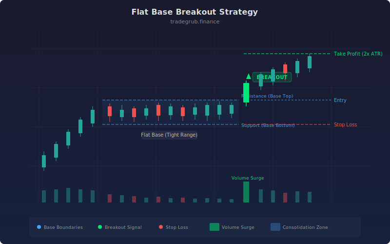

# Flat Base Breakout

A pattern-based strategy that identifies stocks consolidating in a tight, flat range and enters when price breaks above the base on expanding volume. Flat bases form when supply and demand reach equilibrium, compressing the trading range before a directional move. This strategy captures the breakout with a volume confirmation filter and ATR-based risk management.

## Conceptual Diagram



## How It Works

The strategy measures the percentage range between the highest high and lowest low over a configurable lookback period. When this range contracts below the threshold (default 5%), the algorithm identifies a flat base formation. The tighter the consolidation, the more stored energy is available for the eventual breakout.

Entry triggers when price closes above the base high while volume exceeds the average volume by a configurable multiplier. This dual confirmation reduces false breakouts that lack institutional participation. An optional EMA filter ensures entries only occur in the direction of the prevailing trend.

Exits use ATR-based stops and targets. The stop loss is placed at a multiple of ATR below the entry price, while the profit target defaults to twice the stop distance, providing a 2:1 reward-to-risk ratio out of the box.

## Parameters

| Name | Default | Range | Description |
|------|---------|-------|-------------|
| Base Length | 20 | 10-60 | Lookback period for measuring the consolidation range |
| Max Range % | 5.0 | 1.0-15.0 | Maximum allowed range as a percentage of the base low |
| Volume Multiplier | 1.5 | 1.0-4.0 | Breakout volume must exceed average volume by this factor |
| ATR Stop Multiple | 2.0 | 0.5-5.0 | Stop loss distance as a multiple of ATR |
| ATR Length | 14 | 5-50 | Period for ATR calculation |
| EMA Trend Filter | True | on/off | Require price above EMA for long entries |
| EMA Length | 50 | 10-200 | Period for the trend filter EMA |

## Python Advantage

The flat base detection runs entirely as vectorized array operations, avoiding per-bar iteration for the signal logic:

```python
base_high = ta.highest(high, base_len)
base_low = ta.lowest(low, base_len)
base_range = (base_high - base_low) / base_low * 100

is_flat = base_range < range_pct
breakout = close > base_high
vol_surge = volume > avg_vol * vol_mult

entry_signal = is_flat & breakout & vol_surge & above_ema
```

The rolling highest/lowest and SMA calls operate on the full price array at once. Boolean conditions combine with bitwise operators for a single-pass signal calculation.

## When to Use

Flat base breakouts work best in trending markets where stocks pause to digest gains before continuing higher. Look for this pattern after an initial advance of 20% or more, where the stock needs time to build a new support level. The strategy is less effective in choppy, range-bound markets where breakouts tend to fail and reverse.

## Risk Management

The built-in ATR stop adapts to each stock's volatility, placing the stop far enough to avoid noise but close enough to limit drawdowns. The default 2:1 reward-to-risk ratio means the strategy only needs a 34% win rate to break even. Consider reducing position size when the base range is near the upper threshold, as wider bases carry more risk of a failed breakout.

## Combining with Other Indicators

- **RSI divergence:** Look for RSI forming higher lows during the base while price stays flat. This hidden bullish divergence adds conviction to the breakout signal.
- **ADX/DMI filter:** Adding a rising ADX above 20 confirms that the stock is transitioning from a consolidation phase into a trending phase, filtering out low-probability setups.
- **Relative strength ranking:** Pair this strategy with a sector or market relative strength screen to focus on stocks that are consolidating near highs while weaker names break down.
