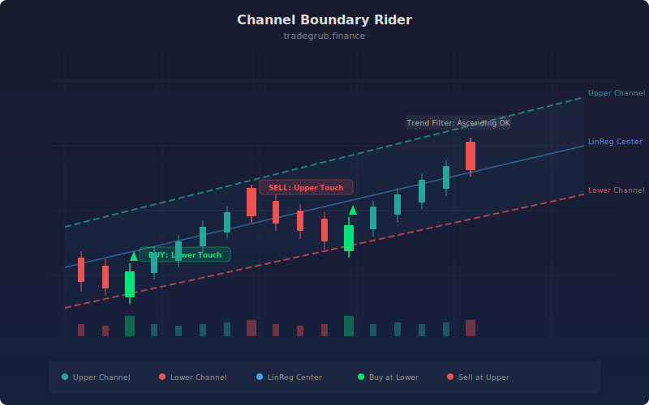

# Channel Boundary Rider

A mean-reversion strategy that fits a linear regression channel around recent price action and trades the boundaries. It buys when price touches the lower band and sells at the upper band, using a trend-direction filter to avoid counter-trend entries.

## Conceptual Diagram



## How It Works

The strategy computes a linear regression line over a configurable lookback window and adds standard deviation bands above and below. When price reaches the lower band, it signals a long entry. When price reaches the upper band, it signals a short entry. Both directions close at the midline.

A trend EMA filter ensures that long entries only fire when price is above the longer-term moving average, and short entries only fire below it. This prevents buying dips in a strong downtrend or shorting rallies in a strong uptrend. An optional RSI filter adds confirmation by requiring oversold readings for longs and overbought readings for shorts.

Risk management uses ATR-based stop-losses and take-profit levels. The ATR multipliers are independently configurable, allowing you to set asymmetric reward-to-risk ratios. Positions that reach the midline without hitting their target are closed as a partial profit take.

## Parameters

| Name | Default | Range | Description |
|------|---------|-------|-------------|
| Regression Length | 50 | 10-200 | Lookback period for the linear regression calculation |
| Channel Width | 2.0 | 0.5-4.0 | Standard deviation multiplier for band width |
| Trend EMA Length | 100 | 20-300 | Period for the trend-direction moving average |
| ATR Length | 14 | 5-50 | Period for Average True Range calculation |
| ATR Stop-Loss Mult | 1.5 | 0.5-4.0 | ATR multiplier for stop-loss distance |
| ATR Take-Profit Mult | 2.5 | 1.0-6.0 | ATR multiplier for take-profit distance |
| Require Trend Alignment | True | on/off | Only enter trades aligned with the trend EMA |
| RSI Confirmation | True | on/off | Require RSI oversold/overbought for entry |

## Python Advantage

The signal logic runs as vectorized boolean operations across the entire price series, avoiding slow per-bar loops for condition evaluation:

```python
long_signal = (close <= lower) & (~require_trend | uptrend) & (~rsi_filter | (rsi < 35))
short_signal = (close >= upper) & (~require_trend | downtrend) & (~rsi_filter | (rsi > 65))
```

This computes all entry signals in a single pass. The per-bar loop is only needed for order management where sequential position state matters.

## When to Use

Channel Boundary Rider works best in range-bound or gently trending markets where price oscillates within a well-defined channel. Look for instruments with consistent mean-reverting behavior on the timeframe you are trading. Wider channels (higher multiplier) produce fewer but higher-confidence signals. Tighter channels generate more trades but increase the chance of whipsaws.

## Risk Management

Every entry includes an ATR-based stop-loss and take-profit. The default configuration sets a 1.5 ATR stop and 2.5 ATR target, giving roughly a 1.67:1 reward-to-risk ratio. Positions also close at the midline if price reverts before reaching the target. Adjust the ATR multipliers to match the volatility profile of your instrument and timeframe.

## Combining with Other Indicators

- **Volume Profile:** Confirm that the lower band aligns with a high-volume node for stronger support on long entries.
- **ADX/DMI:** Use ADX below 25 to confirm range-bound conditions where this strategy performs best. Avoid trading when ADX is rising above 30.
- **VWAP:** Layer VWAP as an additional trend filter. Only take longs above VWAP and shorts below it for institutional flow alignment.
