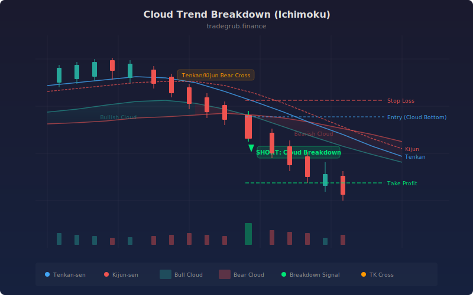

# Cloud Trend Breakdown

This strategy identifies bearish breakdowns through the Ichimoku cloud. It combines a Tenkan-Kijun bearish crossover with price breaking below the cloud bottom, optionally confirmed by the Chikou (lagging) span. The result is a systematic short-entry framework built on classical Ichimoku theory.

## Conceptual Diagram



## How It Works

The strategy calculates the five standard Ichimoku components: Tenkan-sen (conversion line), Kijun-sen (base line), Senkou Span A, Senkou Span B, and the Chikou (lagging) span. The cloud is formed between Senkou A and Senkou B, representing a zone of dynamic support and resistance.

A short entry triggers when three conditions align: the Tenkan crosses below the Kijun (bearish momentum shift), price closes below the bottom of the cloud (loss of support), and optionally the Chikou span sits below the cloud (historical confirmation). This triple filter reduces false signals compared to using any single condition alone.

Exits occur when the Tenkan crosses back above the Kijun or price reclaims the top of the cloud, signaling that bearish momentum has faded. An ATR-based stop multiplier is available for risk sizing.

## Parameters

| Name | Default | Range | Description |
|------|---------|-------|-------------|
| Tenkan Period | 9 | 5-30 | Lookback for the conversion line (short-term midpoint) |
| Kijun Period | 26 | 15-60 | Lookback for the base line (medium-term midpoint) |
| Senkou B Period | 52 | 30-120 | Lookback for the slower cloud boundary |
| Displacement | 26 | 10-52 | Forward/backward shift for cloud and Chikou span |
| ATR Period | 14 | 5-30 | Period for Average True Range calculation |
| ATR Stop Multiplier | 2.0 | 0.5-5.0 | Multiplier applied to ATR for stop-loss distance |
| Chikou Confirmation | True | on/off | Require lagging span below the cloud for entry |
| Risk Per Trade % | 1.0 | 0.1-5.0 | Position risk as a percentage of account equity |

## Python Advantage

The Ichimoku components are computed as full vectorized arrays, making the cloud boundaries available across the entire dataset without per-bar iteration:

```python
tenkan = (ta.highest(high, tenkan_len) + ta.lowest(low, tenkan_len)) / 2
kijun = (ta.highest(high, kijun_len) + ta.lowest(low, kijun_len)) / 2
cloud_top = numpy.maximum(senkou_a, senkou_b)

entry_signal = price_below_cloud & tk_cross_bear & chikou_below
```

Boolean conditions combine with `&` operators, producing a single signal array that can be evaluated in one pass.

## When to Use

This strategy works best on trending instruments that exhibit sustained directional moves. It is designed for markets where Ichimoku analysis has historically performed well: forex majors, index futures, and liquid large-cap equities. Ranging or choppy markets will produce whipsaw signals, so pairing with a volatility or regime filter is recommended.

## Risk Management

The ATR-based stop multiplier controls the maximum adverse excursion per trade. With the default 2x ATR stop, the strategy gives trades room to breathe while capping downside. The risk-per-trade percentage input allows consistent position sizing relative to account equity. Always validate stop placement against the cloud boundaries, as re-entry into the cloud often signals a failed breakdown.

## Combining with Other Indicators

- **Volume confirmation:** require above-average volume on the breakdown bar to filter low-conviction entries. A simple `volume > ta.sma(volume, 20)` condition works well.
- **RSI divergence:** look for RSI making lower highs while price tests the cloud from below. This adds a momentum divergence layer that strengthens the bearish thesis.
- **ADX filter:** use `ta.dmi()` to confirm a trending environment (ADX above 20-25) before taking cloud breakdown signals, reducing entries during flat or consolidating periods.
