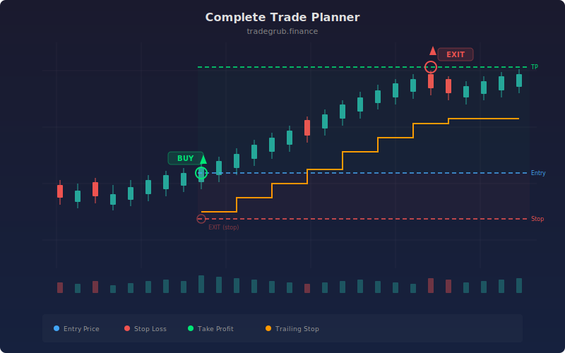

# Complete Trade Planner

Multi-indicator entry and exit framework that scores each bar using RSI, moving average trend, and MACD histogram. A trade triggers only when at least N indicators agree on direction, reducing false signals. Exits use a three-layer system: fixed stop loss, fixed take profit, and a trailing stop, closing the position on whichever level is hit first.

## Concept

## Parameters

- **RSI/MA/ATR Length**: Indicator periods (default: 14, 20, 14)
- **Stop Loss ATR Mult**: Fixed stop distance (default: 2.0)
- **Take Profit ATR Mult**: Profit target distance (default: 3.0)
- **Trailing Stop ATR Mult**: Trailing stop distance (default: 1.5)
- **Min Signals**: Required signal agreement count (default: 2)

## Signals

- **Long**: Multiple indicators agree on bullish conditions
- **Short**: Multiple indicators agree on bearish conditions
- **Exit**: Fixed SL, fixed TP, or trailing stop (whichever hits first)
