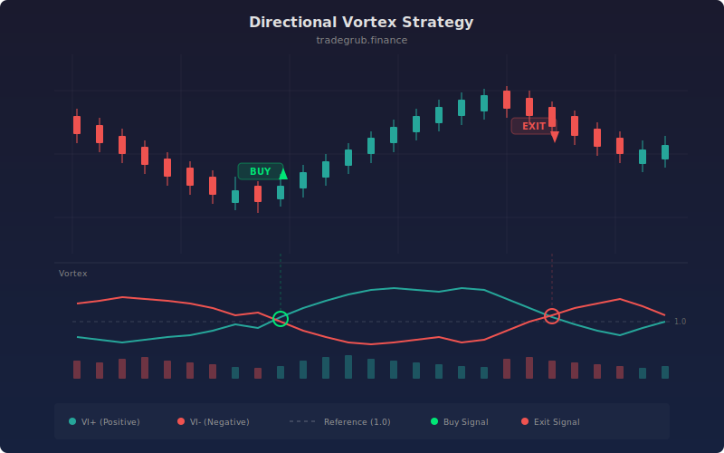

# Directional Vortex Strategy

Trend direction strategy built on the Vortex Indicator (VI+ and VI-). Instead of entering on every VI crossover, it requires the difference between the two lines to exceed a configurable threshold before triggering a trade. This filters out weak, indecisive crossovers and focuses entries on strong directional moves. ATR-based stops and targets manage risk.

## Concept

## Parameters

- **Vortex Length**: Vortex indicator period (default: 14)
- **ATR Length**: ATR period for stops (default: 14)
- **Stop/TP ATR Mult**: Stop and take profit distances (default: 2.0/3.0)
- **Cross Threshold**: Minimum VI+/VI- difference for entry (default: 0.1)

## Signals

- **Long**: VI+ minus VI- crosses above threshold
- **Short**: VI- minus VI+ crosses above threshold
