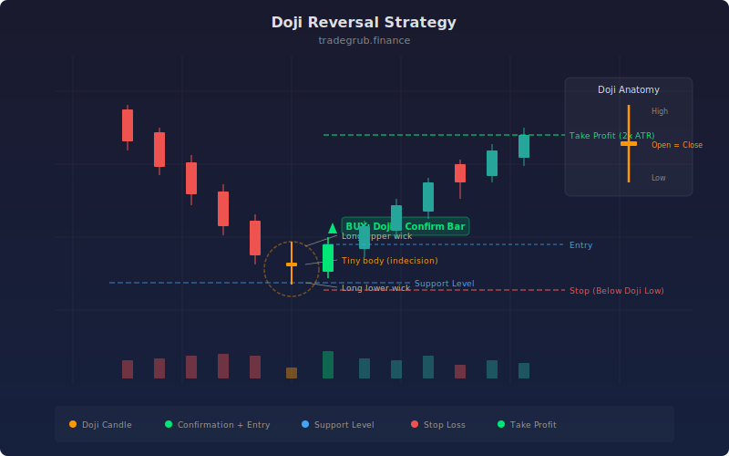

# Doji Reversal

The Doji Reversal strategy identifies doji candlestick patterns at key support and resistance levels, then enters trades on confirmation from the following bar. A doji forms when a candle's body is extremely small relative to its range, indicating indecision between buyers and sellers. When this indecision occurs near a support or resistance extreme, it often precedes a reversal. This strategy adds confirmation logic and ATR-based profit targets and stops to transform a classic candlestick pattern into a complete trading system.

## Conceptual Diagram



## How It Works

The strategy first identifies doji candles by computing the body-to-range ratio for each bar. When the absolute difference between open and close divided by the high-low range falls below the doji threshold (default 5%), the bar qualifies as a doji. The numpy `np.where` function handles the edge case where the candle range is zero, preventing division errors.

Next, the strategy computes dynamic support and resistance levels using rolling highest-high and lowest-low over a configurable lookback (default 20 bars). A doji is considered "near support" if the distance between the candle's low and the support level is less than 30% of the current ATR. Similarly, a doji is "near resistance" if the distance between resistance and the candle's high is within 30% of ATR.

The confirmation step is critical: the strategy does not enter on the doji bar itself. Instead, it checks whether the previous bar was a doji at support or resistance, and then requires the current bar to confirm the reversal direction. For a bullish reversal, the current bar must close above its open (bullish candle following a doji at support). For a bearish reversal, the current bar must close below its open.

Exits use ATR-based stop-loss and take-profit levels. The stop is placed half an ATR beyond the doji's extreme (below the low for longs, above the high for shorts), and the profit target is set at a configurable ATR multiple (default 2.0) from the confirmation bar's close.

## Parameters

| Parameter | Default | Range | Description |
|-----------|---------|-------|-------------|
| ATR Length | 14 | 5-50 | Period for ATR calculation used in stops, targets, and proximity detection |
| ATR Target Multiplier | 2.0 | 1.0-5.0 | Multiple of ATR for the profit target distance |
| Doji Body % of Range | 0.05 | 0.01-0.15 | Maximum body-to-range ratio to qualify as a doji |
| Support/Resistance Lookback | 20 | 10-50 | Number of bars for computing rolling highest high and lowest low |

## Python Advantage

The strategy uses numpy's `np.abs`, `np.where`, and array arithmetic to compute candlestick geometry across the full dataset in vectorized operations, then uses array indexing for the two-bar confirmation pattern.

```python
# Vectorized candlestick geometry — all bars at once
body = np.abs(close - open)
candle_range = high - low
body_pct = np.where(candle_range > 0, body / candle_range, 1.0)

# np.where prevents division-by-zero on zero-range bars
# Returns 1.0 (non-doji) when range is zero

# Two-bar pattern detection with array indexing
prev_doji_bull = body_pct[-2] <= doji_pct and (low[-2] - support[-2]) < atr[-2] * 0.3
bull_confirm = prev_doji_bull and close[-1] > open[-1]

# ATR-scaled exits computed from confirmation bar
strategy.exit("Long Exit", "Long",
              stop=low[-2] - atr[-1] * 0.5,
              limit=close[-1] + atr[-1] * atr_mult)
```

The `np.where` conditional array operation replaces what would be a verbose if/else loop in other languages. The `[-2]` and `[-1]` indexing pattern enables clean two-bar pattern detection, checking the doji condition on the previous bar and the confirmation condition on the current bar in a single compound expression.

## When to Use

Works best at well-defined support and resistance levels on daily and 4-hour timeframes. Effective on individual stocks approaching historical price levels, forex pairs at round numbers or prior swing points, and any instrument with clear horizontal levels. The strategy generates infrequent signals since it requires the convergence of a doji pattern, proximity to a key level, and directional confirmation. Avoid on instruments with consistently small ranges where the doji threshold is triggered too frequently.

## Risk Management

The built-in ATR stops provide automatic risk management. The stop at half an ATR beyond the doji extreme keeps risk tight relative to the pattern. The 2:1 default reward-to-risk ratio (2.0 ATR target vs roughly 0.5 ATR stop) means the strategy only needs a win rate above 33% to be profitable. Adjust the target multiplier based on the instrument's typical move size after reversals at key levels. For conservative trading, increase the doji body threshold to require tighter doji patterns, which occur less often but have stronger reversal implications.

## Combining with Other Indicators

- **Bollinger Band Bounce**: Doji patterns that form at Bollinger Band extremes combine two reversal signals for higher-conviction entries.
- **EMA Distance**: Use EMA distance to confirm that price is stretched from its mean when the doji forms, adding statistical support to the reversal thesis.
- **Elder Impulse**: Check the Elder Impulse color to ensure momentum is shifting in the expected reversal direction before confirming the doji signal.
