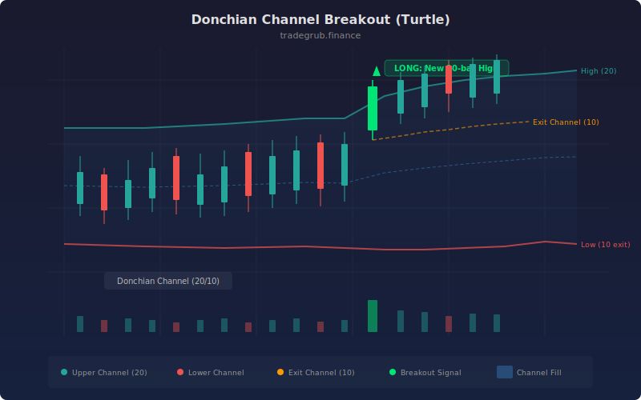

# Donchian Channel Breakout

The Donchian Channel Breakout strategy implements the classic Turtle Trading system developed by Richard Dennis and William Eckhardt in the 1980s. Donchian channels plot the highest high and lowest low over a lookback period, forming a price channel. Breakouts beyond this channel signal the start of new trends. This implementation uses separate entry and exit channel lengths and adds an optional ATR trailing stop for enhanced risk management.

## Conceptual Diagram



## How It Works

The strategy builds two sets of Donchian channels with different lookback periods. The entry channel (default 20 bars) defines the breakout levels: the highest high and lowest low over 20 bars. The exit channel (default 10 bars) uses a shorter lookback to create tighter levels for closing positions. This dual-channel approach is the hallmark of the original Turtle system.

A long entry triggers when price crosses above the entry channel upper level (20-bar highest high). This breakout indicates that price has exceeded all resistance over the lookback period and a new uptrend may be starting. A short entry triggers when price crosses below the entry channel lower level (20-bar lowest low).

Exits use the shorter exit channel. A long position closes when price crosses below the 10-bar lowest low, indicating that the uptrend has weakened enough to break short-term support. A short position closes when price crosses above the 10-bar highest high. The shorter exit channel creates a tighter leash that preserves more profit than waiting for a full entry-channel reversal.

The optional ATR trailing stop adds a volatility-adjusted safety net. When enabled, it sets a trailing stop offset at a multiple of ATR (default 2.0) from the peak price. This provides protection during sudden reversals that might not immediately trigger the exit channel crossunder.

The strategy also computes a basis line (midpoint of the entry channel) for reference, showing where the equilibrium price sits within the channel.

## Parameters

| Parameter | Default | Range | Description |
|-----------|---------|-------|-------------|
| Entry Channel Length | 20 | 5-100 | Lookback period for the breakout channel (highest high / lowest low) |
| Exit Channel Length | 10 | 3-50 | Shorter lookback for the exit channel |
| Use ATR Trailing Stop | true | true/false | Whether to apply an ATR-based trailing stop in addition to channel exits |
| ATR Length | 14 | 5-50 | Period for the ATR calculation used in the trailing stop |
| ATR Stop Multiplier | 2.0 | 0.5-5.0 | Multiple of ATR for the trailing stop offset |

## Python Advantage

The strategy uses the `ta.donchian()` function to compute both channel sets in vectorized calls, returning upper, lower, and basis as numpy array tuples. The optional ATR trailing stop is conditionally applied using a boolean input parameter.

```python
# Dual Donchian channels — entry and exit — in two vectorized calls
entry_upper, entry_lower, entry_basis = ta.donchian(high, low, entry_length)
exit_upper, exit_lower, exit_basis = ta.donchian(high, low, exit_length)

# Breakout detection on dynamic channel levels
long_entry = ta.crossover(close, entry_upper)
short_entry = ta.crossunder(close, entry_lower)

# Conditional ATR trailing stop — toggled by boolean input
if use_atr_stop:
    strategy.exit("Long SL", from_entry="Long",
                  trail_offset=atr[-1] * atr_mult)
```

The tuple unpacking of `ta.donchian()` into three arrays provides immediate access to upper, lower, and basis without intermediate calculations. The `input.bool()` parameter enables runtime toggling of the ATR stop, creating two distinct strategy variants from a single codebase.

## When to Use

Best suited for trending markets and instruments that make sustained directional moves: commodity futures, trending forex pairs, and momentum stocks. The strategy was originally designed for daily timeframes and performs well on daily and weekly charts. The 20/10 channel combination is a proven default from the Turtle Trading era. Avoid on range-bound instruments where breakouts consistently fail and revert.

## Risk Management

The dual-channel structure provides inherent risk management: the shorter exit channel limits drawdowns during reversals. The ATR trailing stop adds a second layer of protection. Position sizing should follow the Turtle principle of risking no more than 1-2% of account equity per trade, calculated as position size = risk amount / (ATR x multiplier). The entry channel length determines how significant a breakout must be: longer channels require more substantial moves, reducing false breakouts but delaying entries.

## Combining with Other Indicators

- **ADX Trend**: Filter breakouts by requiring ADX above 25, ensuring that the channel break coincides with genuine trend strength rather than a momentary spike.
- **Choppiness Filter**: Avoid entering breakouts when the Choppiness Index is elevated, filtering out false breakouts during consolidation phases.
- **ATR Trailing Stop**: If the built-in ATR stop is disabled, pair with the standalone ATR Trailing Stop strategy for more sophisticated exit management with separate parameters.
