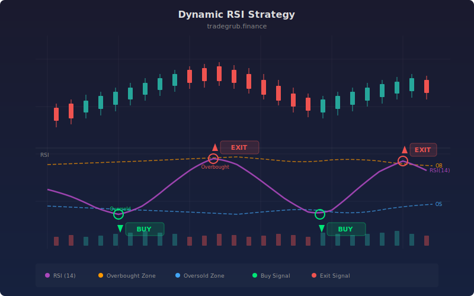

# Dynamic RSI Strategy

Mean reversion strategy that replaces fixed RSI overbought/oversold levels with dynamic zones that shift based on ATR volatility percentile. In volatile markets the zones widen (requiring stronger RSI extremes before entry), and in calm markets the zones tighten to capture smaller reversals. Entries trigger when RSI crosses back through the adaptive zone boundary.

## Concept

## Parameters

- **Base RSI Length**: Base period for RSI (default: 14)
- **ATR Length**: ATR for stops and zone adaptation (default: 14)
- **Stop/TP ATR Mult**: Stop and take profit distances (default: 2.0/2.5)

## Signals

- **Long**: RSI crosses back above dynamic oversold zone
- **Short**: RSI crosses back below dynamic overbought zone
