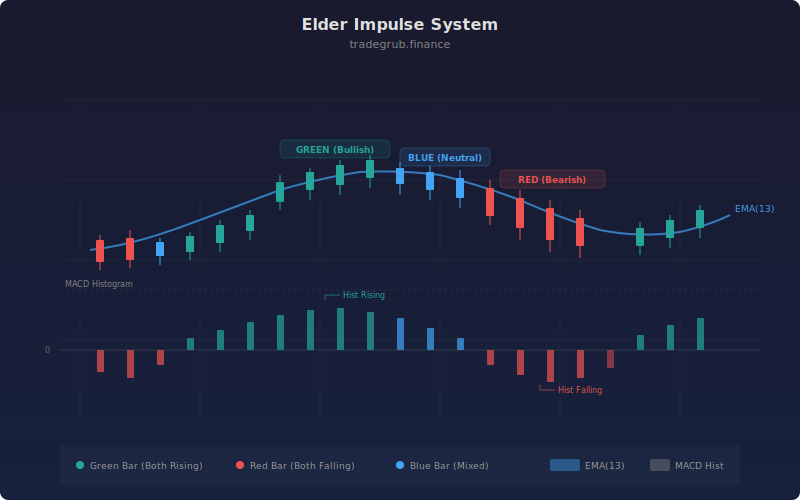

# Elder Impulse System

The Elder Impulse System was developed by Dr. Alexander Elder to classify every bar as bullish, bearish, or neutral based on the agreement between two momentum measures: the slope of an exponential moving average and the slope of the MACD histogram. When both are rising, the bar is green (bullish impulse). When both are falling, the bar is red (bearish impulse). Mixed signals produce a blue/neutral bar. This color-coded system provides instant visual clarity about market momentum and forms the basis for entry and exit decisions.

## Conceptual Diagram




## How It Works

The strategy computes two momentum components. The first is the EMA slope: it calculates the bar-to-bar change in a 13-period EMA using `ta.change()`. A positive change means the EMA is rising (bullish momentum), and a negative change means it is falling. The EMA acts as a smoothed proxy for the intermediate-term trend direction.

The second component is the MACD histogram slope. The MACD histogram itself measures the distance between the MACD line and its signal line, and the bar-to-bar change in this histogram captures momentum acceleration. A rising histogram means bullish momentum is accelerating (or bearish momentum is decelerating), while a falling histogram signals the opposite.

A green (bullish impulse) bar occurs when both the EMA change and the histogram change are positive. This means the intermediate trend is rising AND momentum is accelerating, representing the strongest bullish condition. A red (bearish impulse) bar occurs when both are negative: falling trend AND accelerating bearish momentum.

The strategy enters long on green bars and enters short on red bars. Exits mirror the entries: long positions close on red impulse bars, and short positions close on green bars. In practice this means the strategy is always positioned in the direction of the current impulse, switching sides when the impulse color flips.

The background color of the chart changes to reflect the impulse state, providing immediate visual feedback about market conditions even when no trade is triggered.

## Parameters

| Parameter | Default | Range | Description |
|-----------|---------|-------|-------------|
| EMA Length | 13 | 5-50 | Period for the exponential moving average used to measure trend direction |
| MACD Fast | 12 | 5-30 | Fast EMA period for MACD calculation |
| MACD Slow | 26 | 10-50 | Slow EMA period for MACD calculation |
| MACD Signal | 9 | 3-20 | Signal line smoothing period for MACD |

## Python Advantage

The strategy uses `ta.change()` for vectorized slope computation and combines boolean conditions to classify every bar's impulse state in a single expression.

```python
# Vectorized slope detection — change() returns bar-over-bar difference
ema_rising = ta.change(ema, 1)
hist_rising = ta.change(hist, 1)

# Impulse classification: both slopes must agree
green_bar = (ema_rising[-1] > 0) and (hist_rising[-1] > 0)
red_bar = (ema_rising[-1] < 0) and (hist_rising[-1] < 0)

# MACD decomposition via tuple unpacking
macd_line, signal_line, hist = ta.macd(close, macd_fast, macd_slow, macd_signal)

# Background color changes reflect impulse state visually
bgcolor(green_bar, color="rgba(0, 200, 0, 0.15)")
bgcolor(red_bar, color="rgba(200, 0, 0, 0.15)")
```

The `ta.macd()` tuple return provides all three MACD components at once. The `ta.change()` function computes the first derivative (slope) as a vectorized array operation, replacing the manual subtraction of shifted arrays. The `bgcolor()` function applies conditional background shading across the chart.

## When to Use

The Elder Impulse System works on all timeframes but is most effective on daily and weekly charts for swing trading. Dr. Elder originally designed it for the weekly timeframe as a trend filter. It works well on stocks, forex, and futures. The system excels at keeping traders on the right side of momentum and preventing premature entries against the prevailing impulse. Avoid during extended sideways consolidations where the impulse flips rapidly between colors.

## Risk Management

The impulse color provides the stop signal: exit immediately when the impulse turns against your position. This means risk is defined by how far price moves before the impulse flips, which varies by volatility. For tighter risk control, add an ATR-based stop as a safety net in case a sudden gap prevents a clean impulse-color exit. The strategy will generate frequent trades during transitional periods when the impulse alternates rapidly; consider requiring consecutive same-color bars before entering.

## Combining with Other Indicators

- **EMA Crossover**: Use the impulse color as a filter for EMA crossover entries. Only take crossover longs on green bars and crossover shorts on red bars.
- **Bollinger Band Bounce**: Combine band touches with impulse color changes. A lower band touch followed by a green impulse flip provides strong reversal confluence.
- **ADX Trend**: Add ADX confirmation to ensure the impulse color change occurs during a trending market rather than a choppy one.
