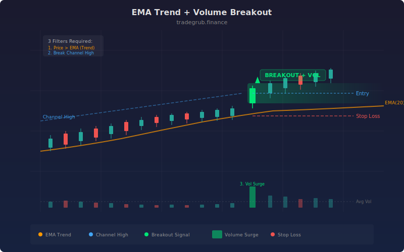

# EMA Trend + Volume Breakout

The EMA Volume Breakout strategy combines three distinct filters into a single high-conviction entry system: EMA trend direction, volume surge confirmation, and price breakout beyond a lookback channel. The concept is that genuine breakouts are accompanied by above-average volume, and this volume should occur in the direction of the prevailing trend. By requiring all three conditions simultaneously, the strategy filters out the vast majority of false breakouts and noise-driven moves.

## Conceptual Diagram




## How It Works

The strategy computes fast and slow EMAs to determine trend direction. When the fast EMA (default 9) is above the slow EMA (default 21), the market is in an uptrend. When the fast is below the slow, it is in a downtrend. This establishes the directional bias for all entries.

Volume confirmation requires the current bar's volume to exceed the average volume (SMA of volume over 20 bars) multiplied by a surge multiplier (default 1.5x). This filters out breakouts that occur on normal or below-average volume, which are more likely to be false signals. Institutional participation typically drives volume spikes at genuine breakout points.

The price breakout component uses a rolling highest-high and lowest-low over a lookback period (default 20 bars). A long entry requires closing at or above the highest high, confirming that price has broken out of its recent range. A short entry requires closing at or below the lowest low.

All three conditions must be true simultaneously: correct EMA trend direction, volume surge, AND price breakout. The strategy evaluates these as vectorized boolean arrays and processes entries in a loop across the full dataset, allowing it to catch every qualifying signal in the backtest history.

No explicit exit conditions are defined beyond the opposing entry signal. Long positions are replaced by short entries when bearish conditions align, and vice versa.

## Parameters

| Parameter | Default | Range | Description |
|-----------|---------|-------|-------------|
| Fast EMA | 9 | 2-50 | Period for the fast trend EMA |
| Slow EMA | 21 | 5-100 | Period for the slow trend EMA |
| Volume Surge Multiplier | 1.5 | 1.0-5.0 | Multiple of average volume required to confirm a surge |
| Volume Average Length | 20 | 5-50 | Lookback period for the volume moving average |
| Breakout Lookback | 20 | 5-100 | Number of bars for the highest-high / lowest-low channel |

## Python Advantage

The strategy uses vectorized boolean masking across four independent conditions to produce a compound entry signal, then iterates through the result array for sequential execution.

```python
# Vectorized volume surge detection — boolean array
vol_avg = ta.sma(volume, vol_avg_len)
volume_surge = volume > (vol_avg * vol_mult)

# Breakout levels as numpy arrays
high_break = ta.highest(high, lookback)
low_break = ta.lowest(low, lookback)

# Compound condition: trend + volume + breakout in one expression
uptrend = ema_f > ema_s
long_cond = uptrend & volume_surge & (close >= high_break)
short_cond = downtrend & volume_surge & (close <= low_break)

# Sequential execution over vectorized boolean array
for i in range(len(close)):
    if long_cond[i]:
        strategy.entry("Long", strategy.LONG)
    elif short_cond[i]:
        strategy.entry("Short", strategy.SHORT)
```

The `&` operator chains four boolean arrays element-wise, producing a single mask that is True only where ALL conditions align. The `volume > (vol_avg * vol_mult)` comparison broadcasts across the full volume history, computing surge detection for every bar without loops. The background color function `bgcolor(volume_surge, ...)` highlights surge bars visually.

## When to Use

Best on instruments where volume is a reliable indicator of institutional participation: individual stocks, ETFs, and futures. Less effective on forex where volume data is fragmented. Daily and 4-hour timeframes work well. The strategy generates infrequent but high-conviction signals since the triple-filter requirement is strict. Ideal for breakout traders who want to avoid the common trap of buying low-volume breakouts that immediately fail.

## Risk Management

The strict triple-filter naturally reduces the number of trades, so each signal carries more weight. Place stops below the breakout level (the prior highest-high or lowest-low) since a return inside the channel invalidates the breakout thesis. The volume surge multiplier is the key sensitivity control: higher values (2.0+) produce fewer but more reliable signals. Position sizing should be based on the distance between entry and the channel boundary, keeping risk per trade at a fixed percentage of equity.

## Combining with Other Indicators

- **ATR Breakout**: Use ATR expansion as an additional volatility confirmation alongside the volume surge, requiring both volume and volatility to expand at the breakout point.
- **ADX Trend**: Add ADX confirmation to ensure the EMA trend direction has genuine strength, filtering out weak trends where crossovers are unreliable.
- **BB Width Squeeze**: Identify squeeze conditions before the breakout occurs, positioning for volume-confirmed expansions out of tight consolidations.
