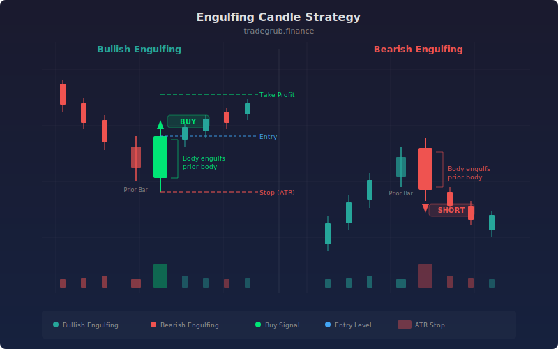

# Engulfing Candle

The Engulfing Candle strategy detects bullish and bearish engulfing candlestick patterns and enters trades with ATR-based stop-losses. An engulfing pattern occurs when the current candle's body completely covers the previous candle's body, signaling a decisive shift in control from buyers to sellers (or vice versa). This two-bar reversal pattern is one of the most reliable candlestick signals in technical analysis, and this implementation adds a body ratio filter and automatic risk management.

## Conceptual Diagram




## How It Works

The strategy identifies engulfing patterns by analyzing the relationship between the current and previous candle bodies. A bullish engulfing requires: (1) the previous candle is bearish (close below open), (2) the current candle is bullish (close above open), (3) the current close is above the previous open, and (4) the current open is below the previous close. This means the current candle's body completely wraps around the previous candle's body.

An additional quality filter requires the current candle's body ratio (body size divided by total high-low range) to meet a minimum threshold (default 0.6). This ensures the engulfing candle has a decisive body rather than being dominated by wicks, which would weaken the reversal signal. The numpy `np.where` function handles the edge case of zero-range candles.

Bearish engulfing patterns mirror the logic: the previous candle must be bullish, the current candle bearish, and the current body must engulf the previous body. The same body ratio filter applies.

Upon entry, the strategy immediately sets an ATR-based stop-loss. For long entries, the stop is placed at the current close minus 1.5x ATR. For short entries, the stop is above the close by the same distance. This provides automatic risk management proportional to current volatility without requiring a separate exit strategy.

## Parameters

| Parameter | Default | Range | Description |
|-----------|---------|-------|-------------|
| ATR Length | 14 | 5-50 | Period for ATR calculation used in stop-loss placement |
| ATR Stop Multiplier | 1.5 | 0.5-5.0 | Multiple of ATR for the stop-loss distance from entry |
| Min Body Ratio | 0.6 | 0.3-0.9 | Minimum ratio of body size to candle range for the engulfing candle |

## Python Advantage

The strategy uses numpy for vectorized candlestick geometry calculations and combines multiple boolean conditions for pattern detection in clean, readable expressions.

```python
# Vectorized body and wick geometry across all bars
body = np.abs(close - open)
candle_range = high - low
body_ratio = np.where(candle_range > 0, body / candle_range, 0)

# Multi-condition pattern detection using array indexing
prev_bearish = close[-2] < open[-2]
curr_bullish = close[-1] > open[-1]

bullish_engulf = (prev_bearish and curr_bullish and
                  close[-1] > open[-2] and open[-1] < close[-2] and
                  body_ratio[-1] >= min_body_ratio)

# Immediate ATR-scaled stop placement on entry
if bullish_engulf:
    strategy.entry("Long", strategy.LONG)
    strategy.exit("Long SL", "Long", stop=close[-1] - atr[-1] * atr_mult)
```

The `np.abs` and `np.where` functions compute body sizes and ratios for the entire dataset in vectorized operations. The four-condition compound boolean for the engulfing pattern uses `[-2]` and `[-1]` indexing for clean two-bar pattern detection. The `strategy.exit()` call with a computed stop level ties risk management directly to volatility.

## When to Use

Works best at key support and resistance levels, trend reversal points, and after extended directional moves on daily and 4-hour timeframes. Effective on individual stocks, forex pairs, and any instrument with reliable candlestick data. The body ratio filter makes this strategy particularly effective on instruments with clean price action. Avoid on very low-volume or illiquid instruments where candle formations are noisy, and during tight consolidation ranges where engulfing patterns lose their reversal significance.

## Risk Management

The built-in ATR stop provides automatic risk management. The 1.5x ATR default creates a stop that gives the trade room to breathe through normal volatility while protecting against adverse moves. The body ratio filter is a secondary risk control: higher ratios (0.7-0.8) produce fewer but higher-quality patterns with stronger reversal implications. No profit target is set by default, so consider adding a reward target at 2-3x the stop distance to maintain a favorable risk-reward ratio.

## Combining with Other Indicators

- **EMA Distance**: Engulfing patterns at EMA distance extremes combine a statistical reversion signal with a candlestick reversal pattern for high-conviction entries.
- **Bollinger Band Bounce**: An engulfing pattern at a Bollinger Band extreme adds candlestick confirmation to the mean-reversion thesis.
- **Elder Impulse**: Check that the Elder Impulse color is shifting in the direction of the engulfing pattern for momentum confirmation.
