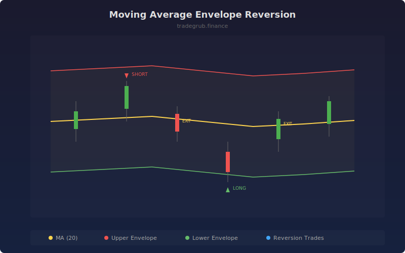

# Moving Average Envelope Reversion

Mean reversion strategy that trades price extremes relative to a moving average envelope. Entries occur when price touches the outer bands and exits target a return to the moving average center, with ATR-based stop losses for risk management.

## How It Works

- Calculates a simple moving average and creates upper/lower envelope bands at a fixed percentage distance
- Enters long when price crosses below the lower envelope, betting on reversion upward
- Enters short when price crosses above the upper envelope, betting on reversion downward
- Targets the moving average as the profit target and uses ATR-multiplied stops for protection
- Closes positions when price returns to the MA center line

## Parameters

| Parameter | Default | Range | Description |
|-----------|---------|-------|-------------|
| MA Length | 20 | 5-200 | Moving average lookback period |
| Envelope % | 2.0 | 0.5-10.0 | Percentage distance for envelope bands |
| ATR Length | 14 | 5-50 | ATR period for stop loss calculation |
| Stop Loss ATR Mult | 1.5 | 0.5-5.0 | ATR multiplier for stop distance |

## Outputs

- **MA**: Center moving average line
- **Upper Envelope**: Resistance band at MA + envelope percentage
- **Lower Envelope**: Support band at MA - envelope percentage
- **Long/Short**: Entry signal markers

## Usage Notes

- Works best in range-bound or choppy markets where price oscillates around the mean
- Increase the envelope percentage for more volatile instruments to avoid premature entries
- Tighter stops (lower ATR multiplier) increase win rate but reduce average win size
