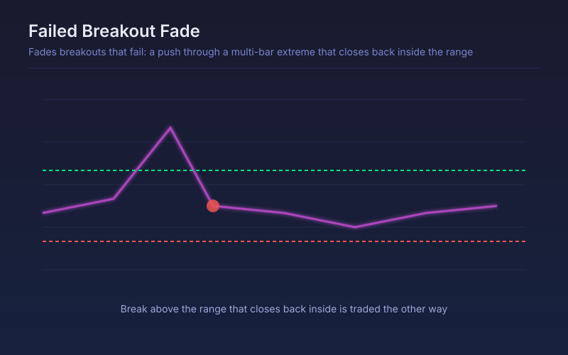

# Failed Breakout Fade

Fades breakouts that fail: a push through a multi-bar extreme that closes back inside the range within a few bars is traded the other way.

## Conceptual Diagram

## Parameters

| Parameter | Default | Range | Description |
|-----------|---------|-------|-------------|
| Range lookback | 20 | 5-100 | Bars used to define the high and low being broken |
| Bars allowed to fail | 3 | 1-10 | How quickly price must close back inside the range |
| ATR length | 14 | 5-50 | ATR length used for the stop and target |
| Stop in ATR beyond the extreme | 1.0 | 0.3-4.0 | Stop distance past the failed extreme |
| Target in ATR | 2.0 | 0.5-6.0 | Profit target measured from entry |

## Signals

- Fade short: price broke the range high, then closed back inside within the allowed window
- Fade long: price broke the range low, then closed back inside
- Stop: beyond the failed extreme by the configured ATR multiple
- Target: a fixed ATR multiple from entry, since these trades revert rather than trend

## Usage

Use in range-bound conditions where breakouts routinely fail, and stand it down once a genuine trend establishes. It is deliberately the opposite side of a breakout system, so running both at once on the same instrument will produce offsetting trades.
