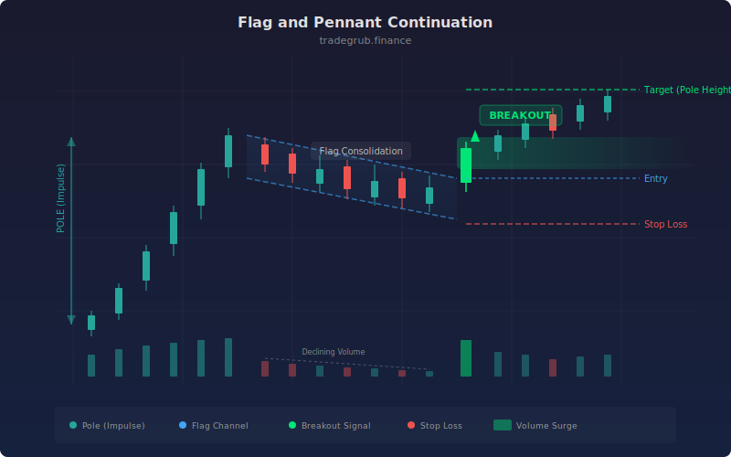

# Flag and Pennant Continuation

This strategy detects classic flag and pennant continuation patterns by identifying a strong impulse move (the pole) followed by a tight, counter-trend consolidation (the flag). It enters on the breakout from the consolidation in the direction of the original impulse. Both bull and bear flags are supported.

## Conceptual Diagram




## How It Works

The strategy first measures the pole by looking at how far price has moved over the pole lookback window. A valid pole must exceed a configurable multiple of the 14-period ATR, ensuring only meaningful impulse moves qualify. This filters out weak, choppy price action that lacks directional conviction.

Once a pole is confirmed, the strategy checks whether the subsequent price action forms a tight consolidation. The flag's range must stay within a maximum retracement percentage of the pole's range. For bull flags, price must hold above a threshold relative to the pole low. For bear flags, price must stay below a threshold relative to the pole high.

Entry triggers when price breaks out of the flag's range with optional volume confirmation. The strategy sets ATR-based stop losses and profit targets on each trade, providing a defined risk/reward structure from the moment of entry.

## Parameters

| Name | Default | Range | Description |
|------|---------|-------|-------------|
| Pole Lookback | 10 | 5-30 | Number of bars to measure the impulse pole |
| Flag Length | 5 | 3-15 | Number of bars to define the consolidation window |
| Pole ATR Multiple | 2.0 | 1.0-5.0 | Minimum pole size as a multiple of ATR |
| Max Retracement | 0.5 | 0.2-0.8 | Maximum flag range as a fraction of pole range |
| Volume Confirmation | True | on/off | Require above-average volume on breakout |
| Volume Multiplier | 1.2 | 1.0-3.0 | Required volume relative to 20-period average |
| ATR Stop Multiple | 1.5 | 0.5-4.0 | Stop loss distance as a multiple of ATR |
| ATR Target Multiple | 3.0 | 1.0-6.0 | Profit target distance as a multiple of ATR |

## Python Advantage

Vectorized boolean arrays make multi-condition pattern detection fast and readable:

```python
bull_pole = (close - ta.lowest(low, pole_len)) > (pole_atr_mult * atr)
bull_flag = (flag_range < flag_retrace_max * pole_range) & (close > pole_low + (1 - flag_retrace_max) * pole_range)
bull_break = ta.crossover(close, flag_high)

signal = bull_pole & bull_flag & bull_break & vol_ok
```

Each condition is a full-length boolean array. Combining them with `&` produces the final signal without any nested if-else logic, and the computation runs across all bars simultaneously.

## When to Use

Flag patterns work best in trending markets where strong directional moves are followed by brief pauses before continuation. Use this strategy on liquid instruments with clear trending behavior. It tends to underperform in range-bound or choppy conditions where consolidations break down rather than continue. Timeframes from 15-minute to daily charts are well suited, though the default parameters are tuned for daily bars.

## Risk Management

Every trade has a defined stop and target set at entry using ATR multiples. The default 1.5x ATR stop with a 3.0x ATR target gives a 1:2 risk/reward ratio. Adjust these parameters based on the volatility profile of your instrument. Tighter stops reduce per-trade risk but increase the chance of being stopped out before the continuation move develops.

## Combining with Other Indicators

- **RSI or Stochastic:** confirm that the flag consolidation has not pushed momentum into overbought/oversold territory, which could signal exhaustion rather than continuation.
- **Moving Averages:** require price to be above a 50 or 200-period moving average for bull flags (or below for bear flags) to align trades with the broader trend.
- **ADX/DMI:** use a rising ADX above 20 to confirm that the market is in a trending state where flag patterns are more likely to resolve as continuations.
