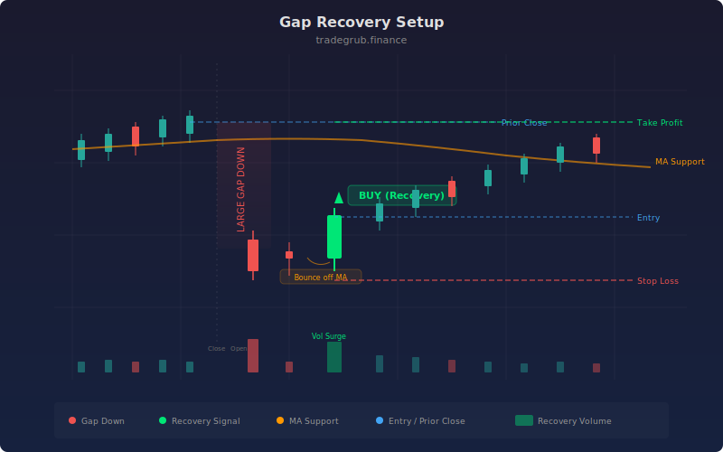

# Gap Recovery Setup

This strategy detects large gap-down openings where price drops sharply from the prior close, then watches for a strong bullish recovery candle near a moving average support level. The goal is to catch the reversal when sellers are exhausted and buyers step in aggressively.

## Conceptual Diagram




## How It Works

The strategy measures the percentage gap between the prior session close and the current open. When this gap exceeds the configured threshold (default 3%), the bar is flagged as a gap-down event. A gap of this size typically signals panic selling or a significant overnight catalyst.

Next, the strategy evaluates the recovery candle. It calculates how much of the bar range the body fills. A close near the high of the bar (filling at least 50% of the range) indicates that buyers absorbed the selling pressure during the session. This recovery must also occur near the simple moving average support level, confirming that price found demand at a meaningful technical zone.

Entry triggers only when RSI confirms oversold conditions, adding a momentum filter. Exits use ATR-based stops and targets, providing adaptive risk management that adjusts to current volatility.

## Parameters

| Name | Default | Range | Description |
|------|---------|-------|-------------|
| Gap Down Threshold % | 3.0 | 1.0 - 10.0 | Minimum gap-down size to qualify as a setup |
| Recovery Fill % | 50.0 | 20.0 - 100.0 | Minimum candle body fill of the bar range |
| Support SMA Length | 50 | 10 - 200 | Period for the simple moving average support |
| RSI Length | 14 | 5 - 30 | Lookback period for RSI calculation |
| RSI Oversold Level | 35 | 20 - 50 | RSI threshold for oversold confirmation |
| ATR Length | 14 | 5 - 30 | ATR lookback for stop and target sizing |
| ATR Stop Loss Multiple | 1.5 | 0.5 - 4.0 | ATR multiplier for stop loss distance |
| ATR Take Profit Multiple | 2.5 | 1.0 - 6.0 | ATR multiplier for take profit distance |

## Python Advantage

Vectorized gap and recovery detection runs across the full price history in a single pass:

```python
gap_size = (prev_close - open) / prev_close * 100
gap_down = gap_size >= gap_pct

candle_body = close - open
recovery_ratio = candle_body / (high - low) * 100
strong_recovery = (candle_body > 0) & (recovery_ratio >= recovery_pct)

entry_signal = gap_down & strong_recovery & near_support & rsi_ready
```

Boolean array operations with `&` replace nested if-else blocks, making the logic both faster and easier to read.

## When to Use

This strategy works best on daily charts for stocks that gap down on earnings misses, analyst downgrades, or broad market selloffs. It targets the first-day reversal pattern where institutional buyers accumulate shares at discounted prices near known support. Tickers with a history of mean-reversion behavior after gaps produce the strongest results.

## Risk Management

Gap-down events carry inherent risk because the catalyst driving the gap may signal a fundamental shift rather than a temporary dislocation. The ATR-based stop loss adapts to current volatility, widening in choppy markets and tightening in calm ones. Always size positions conservatively on gap plays, as a failed recovery can lead to continued selling into the close.

## Combining with Other Indicators

- **Volume confirmation:** Look for above-average volume on the recovery candle to validate that real buying demand is present, not just a low-volume bounce.
- **VWAP reclaim:** A recovery candle that closes above VWAP adds confidence that buyers have regained control of the session.
- **Pre-market levels:** If the stock tested and held a pre-market low before the regular session recovery, the support level carries extra significance.
