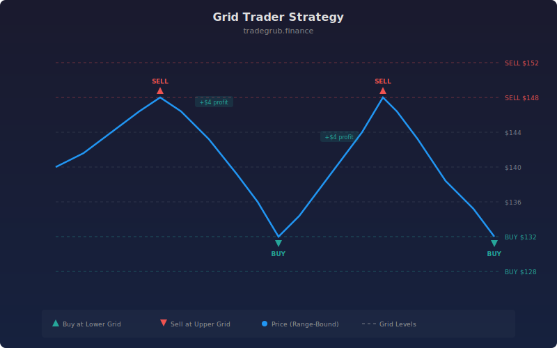

# Grid Level Trader

A grid trading strategy that places entries at lower price levels and exits at upper levels, built for ranging and sideways markets.

## Concept

## How It Works

The strategy calculates a set of evenly spaced grid levels centered on a simple moving average (SMA). When price drops below a lower grid level, a long entry is triggered. When price rises above a grid level above the reference, the position is closed.

Grid spacing can be set as a fixed percentage of the reference price or derived from ATR for volatility-adaptive grids.

## Inputs

- **Grid Spacing (%)**: Distance between grid levels as a percentage of the reference price. Default: 2.0
- **Number of Grid Levels**: How many levels above and below the reference. Default: 5
- **SMA Length**: Period for the reference SMA. Default: 50
- **Use ATR for Spacing**: When enabled, grid spacing is based on 14-period ATR instead of a fixed percentage

## Visual Output

- Green dotted lines: buy grid levels (below reference)
- Red dotted lines: sell grid levels (above reference)
- Gray dotted line: reference SMA level
- BUY/SELL labels at entry and exit points
- Blue SMA line plotted on the chart

## Best Use Cases

- Stocks or pairs trading in a defined range
- Sideways consolidation periods
- Markets with clear support and resistance levels

## Notes

- Grid levels recalculate each bar as the SMA updates, so the grid shifts with the trend
- In strong trending markets, the strategy may underperform since price moves away from the grid
- Combine with a trend filter for better results in mixed conditions
