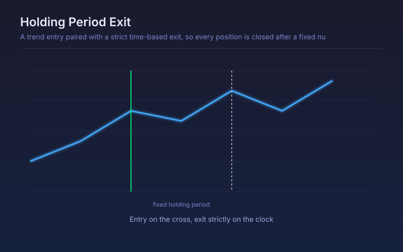

# Holding Period Exit

A trend entry paired with a strict time-based exit, so every position is closed after a fixed number of bars whatever the price is doing.

## Conceptual Diagram

## Parameters

| Parameter | Default | Range | Description |
|-----------|---------|-------|-------------|
| Fast MA length | 10 | 2-100 | Fast average in the crossover entry |
| Slow MA length | 30 | 5-300 | Slow average in the crossover entry |
| Holding period (bars) | 10 | 1-200 | Bars after which the position closes unconditionally |
| ATR length | 14 | 5-50 | ATR length used for the disaster stop |
| Disaster stop in ATR | 2.0 | 0.0-6.0 | Catastrophe stop distance; set to 0 to rely on time alone |
| Trade the short side | True | true/false | Whether crossunders open short positions |

## Signals

- Entry: a fast-over-slow crossover, long, or the reverse for short when enabled
- Timed exit: the position closes once the holding period elapses, regardless of profit or loss
- Disaster stop: an optional ATR stop for the rare case that runs away before the timer expires
- The cross marker shows every exit that happened on time rather than on price

## Usage

Use to measure whether an entry has any edge on its own, before an exit rule is layered on top. Holding-period testing is the standard way to isolate entry quality, and the template makes the same test available for any entry you substitute in.
