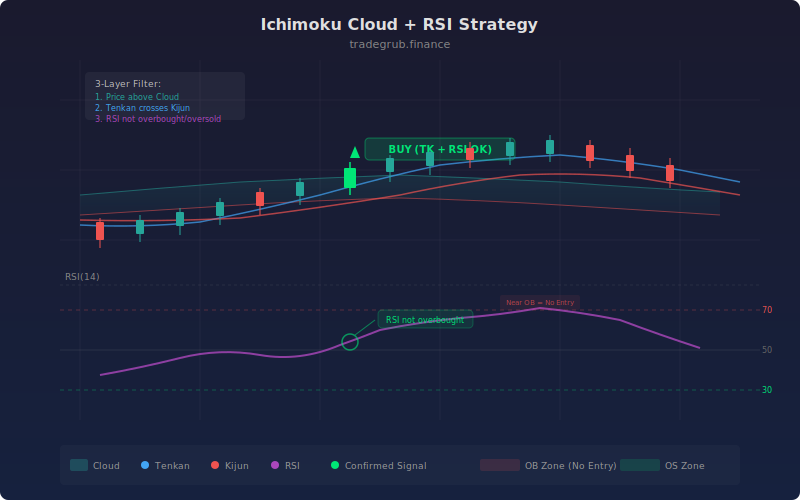

# Ichimoku Cloud + RSI

This strategy combines the Ichimoku Kinko Hyo cloud system with the Relative Strength Index to create a dual-confirmation trend-following and momentum-filtered approach. The Ichimoku cloud defines the trend regime (bullish or bearish), the Tenkan/Kijun relationship confirms directional bias, and the RSI acts as a momentum gate that prevents entries during overbought or oversold extremes. This three-layer filter produces higher-quality signals than either indicator alone.

## Conceptual Diagram




## How It Works

The strategy computes the full Ichimoku system (Tenkan, Kijun, Senkou A, Senkou B, Chikou) from configurable lookback periods. It then calculates the cloud top as `np.maximum(senkou_a, senkou_b)` and cloud bottom as `np.minimum(senkou_a, senkou_b)`, creating two boundary arrays for the entire dataset.

For long entries, three conditions must align simultaneously across the full price array: price must be above the cloud top, Tenkan must be above Kijun (confirming bullish momentum), and RSI must be between 50 and the overbought threshold (default 70). This ensures the entry occurs in a confirmed uptrend with rising momentum but not at an exhaustion extreme.

For short entries, the mirror conditions apply: price below the cloud bottom, Tenkan below Kijun, and RSI between the oversold threshold (default 30) and 50. The RSI filter on both sides prevents chasing moves that are already extended.

All conditions are evaluated as vectorized boolean arrays using numpy's `&` operator, then the strategy iterates through the combined signal array to place entries. This approach processes the entire history in bulk rather than evaluating conditions bar-by-bar, making backtests significantly faster.

## Parameters

| Parameter | Default | Range | Description |
|-----------|---------|-------|-------------|
| Tenkan-sen Period | 9 | 2-50 | Fast equilibrium lookback |
| Kijun-sen Period | 26 | 5-100 | Medium equilibrium lookback |
| Senkou Span B Period | 52 | 10-200 | Slow equilibrium lookback |
| RSI Length | 14 | 2-50 | RSI calculation period |
| RSI Overbought | 70 | 50-90 | Upper RSI threshold (rejects longs above) |
| RSI Oversold | 30 | 10-50 | Lower RSI threshold (rejects shorts below) |

## Python Advantage

The entire signal logic is expressed as vectorized boolean array operations, computing all conditions across every bar in a single pass:

```python
# Vectorized cloud boundaries -- full-array computation
cloud_top = np.maximum(senkou_a, senkou_b)
cloud_bot = np.minimum(senkou_a, senkou_b)

# All conditions evaluated as boolean arrays in one expression
long_cond = (close > cloud_top) & (tenkan > kijun) & (rsi > 50) & (rsi < rsi_ob)
short_cond = (close < cloud_bot) & (tenkan < kijun) & (rsi < 50) & (rsi > rsi_os)
```

Pine evaluates conditions one bar at a time, making complex multi-indicator logic slower and harder to debug. Here, `long_cond` and `short_cond` are complete boolean arrays covering every bar in the dataset, computed with numpy broadcasting. The `np.maximum` and `np.minimum` calls replace what would be nested `math.max()` calls on each bar in Pine.

## When to Use

This strategy performs best on 4-hour and daily timeframes in markets with clear trending behavior. It suits forex majors, commodity futures, and large-cap equities. The RSI filter makes it particularly effective during strong trends by filtering out late entries. Avoid using it in low-volatility, range-bound conditions where the cloud flattens and price oscillates around the Tenkan/Kijun lines.

## Risk Management

Place stops at the opposite cloud boundary or behind the Kijun-sen line. The RSI thresholds provide a built-in guard against chasing extended moves, but additional risk management through ATR-based position sizing is recommended. The strategy trades both long and short, so ensure your account and instrument support short selling before enabling short signals.

## Combining with Other Indicators

- **Mean Reversion ATR**: Use ATR bands to set profit targets once an Ichimoku-RSI entry triggers.
- **Narrow Range Breakout**: Look for NR7 compression patterns within the Ichimoku cloud for explosive breakout entries.
- **Multi-Oscillator Consensus**: Add CCI and Stochastic confirmation to the RSI filter for even higher-conviction signals.
