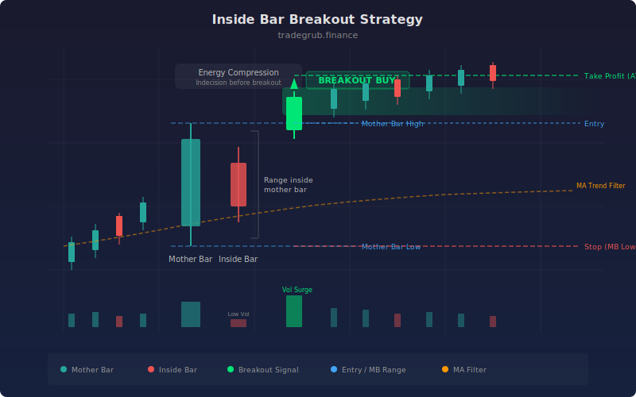

# Inside Bar Breakout

The inside bar is a two-candle price action pattern where the current bar's entire range (high to low) is contained within the previous bar's range. This contraction signals market indecision and energy compression, often preceding a powerful directional move. This strategy detects inside bars, then enters on the breakout of the "mother bar" (the containing bar) with an optional trend alignment filter using a moving average. ATR-based targets and stops provide adaptive risk management.

## Conceptual Diagram




## How It Works

The strategy first detects inside bars by comparing each bar's high and low to the previous bar's high and low using numpy's `np.roll` function. An inside bar is identified when `high <= prev_high` and `low >= prev_low`, computed as a vectorized boolean array across the entire dataset.

On the bar following an inside bar, the strategy watches for a breakout: if price closes above the mother bar's high, it triggers a long entry. If price closes below the mother bar's low, it triggers a short entry. This breakout detection is also vectorized using `ta.crossover(close, prev_high)` combined with `np.roll(inside_bar, 1)` to check the prior bar was an inside bar.

When the trend filter is enabled (default: on), long entries require price to be above the 50-period SMA, and short entries require price to be below it. This prevents counter-trend breakout trades that have lower win rates.

Exits use ATR-based take profit and stop loss levels. The take profit is set at 2.0x ATR from entry (configurable), while the stop is placed just beyond the mother bar's extreme plus a 0.5x ATR buffer. This provides favorable risk-reward ratios while accounting for current market volatility.

## Parameters

| Parameter | Default | Range | Description |
|-----------|---------|-------|-------------|
| ATR Length | 14 | 5-50 | Period for ATR calculation |
| ATR Take Profit Multiplier | 2.0 | 1.0-5.0 | ATR multiple for profit target |
| ATR Stop Buffer | 0.5 | 0.1-2.0 | ATR multiple added to mother bar extreme for stop |
| Require Trend Alignment | True | True/False | Filter entries by trend MA direction |
| Trend MA Length | 50 | 10-200 | SMA period for trend filter |

## Python Advantage

The strategy uses `np.roll` for lookback array shifting, enabling vectorized detection of multi-bar patterns without manual index tracking:

```python
# Vectorized inside bar detection -- no loop, pure array ops
prev_high = np.roll(high, 1)
prev_low = np.roll(low, 1)
inside_bar = (high <= prev_high) & (low >= prev_low)

# Breakout of mother bar on the NEXT bar after inside bar
long_signal = ta.crossover(close, prev_high) & np.roll(inside_bar, 1)
short_signal = ta.crossunder(close, prev_low) & np.roll(inside_bar, 1)

# Trend filter applied as additional boolean mask
if require_trend:
    long_signal = long_signal & (close > trend_ma)
    short_signal = short_signal & (close < trend_ma)
```

Pine cannot shift entire arrays with a single function call. Detecting "the bar after an inside bar" requires tracking state with variables across bars. Python's `np.roll` elegantly shifts the inside_bar boolean array forward by one position, then combines it with the breakout condition using `&` in a single expression.

## When to Use

Inside bar breakouts work best on daily charts where the pattern represents genuine one-day compression. They are effective in trending markets for equities, forex, and futures. The pattern is especially powerful after a strong directional move (flag/pennant formations). Avoid using this on very low timeframes (1-5 minute) where inside bars occur frequently and lack statistical significance.

## Risk Management

The mother bar's low (for longs) or high (for shorts) serves as a natural stop-loss level, with the ATR buffer preventing premature stop-outs from normal volatility. Risk per trade is defined by the distance from entry to the mother bar extreme plus the ATR buffer. Size positions so this distance represents no more than 1-2% of account equity. The 2:1 default reward-to-risk ratio ensures profitability even with moderate win rates.

## Combining with Other Indicators

- **MA Crossover**: Confirm the trend filter with a dual-MA system before trading inside bar breakouts.
- **Narrow Range Breakout**: Inside bars that are also NR7 bars represent double compression, increasing breakout reliability.
- **Momentum Divergence**: Check for RSI divergence before trading inside bar breakouts near support or resistance levels.
