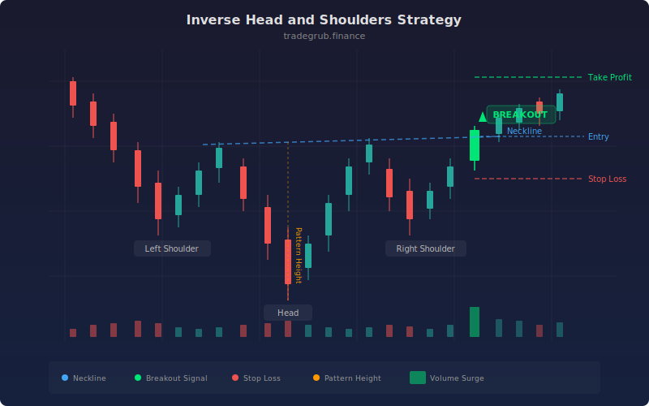

# Inverse Head and Shoulders

The inverse head and shoulders is a classic bottoming reversal pattern formed by three successive troughs, where the middle trough (the head) is the deepest. This strategy scans for the pattern automatically and enters long when price breaks above the neckline connecting the highs between the troughs.

## Conceptual Diagram



## How It Works

The strategy identifies three low points within a configurable lookback window. The middle low (head) must be deeper than the outer two lows (shoulders) by a minimum percentage. The two shoulder lows must be within a configurable tolerance of each other, confirming the symmetry of the pattern.

A neckline is calculated from the highest highs between the shoulder regions and smoothed with a short SMA. When price crosses above the neckline and volume exceeds its moving average (optional), the strategy enters long. The position closes if price drops below the head low, indicating pattern failure.

The profit target is based on the pattern height (neckline minus head low) multiplied by a configurable factor. The stop loss is placed below the entry by a multiple of ATR, giving the trade room to breathe while capping downside.

## Parameters

| Name | Default | Range | Description |
|------|---------|-------|-------------|
| Lookback Period | 50 | 20-200 | Number of bars to scan for the pattern |
| Shoulder Tolerance % | 2.0 | 0.5-10.0 | Max percentage difference between left and right shoulder lows |
| Min Head Depth % | 3.0 | 1.0-15.0 | Minimum percentage the head must be below the shoulders |
| Volume Confirmation | True | on/off | Require above-average volume on the neckline break |
| Stop ATR Multiple | 1.5 | 0.5-4.0 | ATR multiplier for stop loss distance below entry |
| Target Multiple | 2.0 | 1.0-5.0 | Multiplier applied to pattern height for profit target |
| Volume SMA Length | 20 | 5-50 | Period for the volume moving average used in confirmation |

## Python Advantage

Vectorized boolean logic makes pattern detection concise and fast:

```python
head_deeper = (head_low < left_shoulder_low * (1 - min_depth / 100))
shoulders_match = abs(left_shoulder_low - right_shoulder_low) / left_shoulder_low * 100 < shoulder_tol
price_break = ta.crossover(close, neckline_sma)
vol_ok = ~vol_confirm | (volume > vol_sma * 1.2)

pattern_valid = head_deeper & shoulders_match & price_break & vol_ok
```

All four conditions are evaluated across the entire price series in one pass, then combined with bitwise operators.

## When to Use

This strategy works best on daily and weekly charts where the inverse head and shoulders pattern has the most statistical significance. It is suited for trending markets that have pulled back into a basing formation. Shorter timeframes produce more signals but with lower reliability, so tighten the shoulder tolerance and increase the minimum head depth when trading intraday.

## Risk Management

The ATR-based stop loss adapts to current volatility, widening in choppy markets and tightening in calm ones. The pattern height target gives a natural measured move objective. Always size positions so that a stop-out represents no more than 1-2% of account equity. If the pattern fails and price drops below the head, exit immediately rather than waiting for the stop.

## Combining with Other Indicators

- **RSI divergence:** Look for bullish RSI divergence at the head low. If RSI makes a higher low while price makes a lower low, the reversal signal is stronger.
- **Volume profile:** Increasing volume on the right shoulder and breakout bar adds conviction. Declining volume into the head suggests selling pressure is drying up.
- **Moving averages:** A neckline break that also reclaims the 50-period SMA provides confluence and filters out weak breakouts in downtrending markets.
