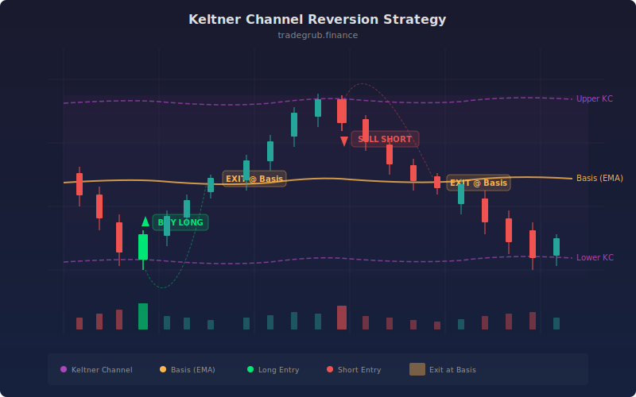

# Keltner Channel Reversion

Keltner Channels, developed by Chester Keltner in the 1960s and later refined by Linda Bradford Raschke, create a volatility envelope around a moving average using the Average True Range (ATR). Unlike Bollinger Bands which use standard deviation, Keltner Channels use ATR for their width, making them less sensitive to single-bar price spikes. This strategy trades mean reversion: entering when price crosses back inside the channel from an extreme and exiting at the channel midline (basis).

## Conceptual Diagram



## How It Works

The strategy calculates Keltner Channels using `ta.kc()`, which produces three arrays: upper band, basis (EMA), and lower band. The upper band is the basis plus a configurable ATR multiplier, and the lower band is the basis minus the same multiplier. The default uses a 20-period channel with a 1.5x ATR multiplier.

Long entries trigger when price crosses above the lower channel band from below, indicating that a downside excursion has reversed and price is mean-reverting back toward the basis. This crossover is detected with `ta.crossover(close, lower)`.

Short entries trigger when price crosses below the upper channel band from above, indicating an upside excursion has exhausted and price is reverting downward. This is detected with `ta.crossunder(close, upper)`.

Both positions exit at the basis (midline). Longs close when price crosses below the basis, and shorts close when price crosses above it. The basis acts as the "fair value" target. This exit logic captures the mean-reversion move without holding through to the opposite channel extreme, which reduces exposure time and drawdown risk.

## Parameters

| Parameter | Default | Range | Description |
|-----------|---------|-------|-------------|
| KC Length | 20 | 5-200 | Lookback period for channel center (EMA) |
| ATR Multiplier | 1.5 | 0.5-5.0 | Width of channel in ATR units |
| ATR Length | 14 | 5-50 | Period for ATR calculation |

## Python Advantage

The strategy unpacks all three Keltner Channel bands from a single tuple return and uses `ta.crossover` / `ta.crossunder` on full arrays to detect channel interactions:

```python
# Single call returns all three bands as arrays
upper, basis, lower = ta.kc(close, high, low, close, length, mult)

# Crossover detection on full arrays -- entry and exit logic
if ta.crossover(close, lower)[-1]:    # Price rebounds from lower band
    strategy.entry("Long", strategy.LONG)
if ta.crossunder(close, upper)[-1]:   # Price rejected at upper band
    strategy.entry("Short", strategy.SHORT)

# Exit at basis -- mean reversion target
if ta.crossover(close, basis)[-1]:
    strategy.close("Short")
if ta.crossunder(close, basis)[-1]:
    strategy.close("Long")
```

The tuple unpacking pattern `upper, basis, lower = ta.kc(...)` is a Python idiom that assigns three complete numpy arrays in one statement. Pine requires three separate variable assignments. The `[-1]` indexing for current-bar evaluation is clean and avoids the need for Pine's implicit series evaluation model.

## When to Use

Keltner Channel mean reversion works best in range-bound and gently trending markets on 1-hour to daily timeframes. It suits liquid equities, ETFs, and forex pairs that oscillate around a mean. The strategy struggles in strong breakout environments where price pushes through the channel and trends away from the basis. Tighten the ATR multiplier (closer to 1.0) for calmer markets and widen it (2.0+) for volatile instruments.

## Risk Management

Stop-losses should be placed beyond the channel extreme at entry time, as a close beyond the channel on increasing volume suggests a breakout rather than a reversion setup. The distance from the channel band to the basis defines your expected profit, so ensure position sizing accounts for the channel width. Avoid taking reversion trades in the direction opposite to a strong higher-timeframe trend.

## Combining with Other Indicators

- **Multi-Oscillator Consensus**: Use RSI/CCI/Stochastic confirmation to validate that price at the channel extreme is truly oversold or overbought.
- **MACD Crossover**: Wait for a MACD crossover in the reversion direction before entering at the Keltner band.
- **Ichimoku Cloud**: Use the Ichimoku cloud to determine the dominant trend and only take Keltner reversion trades in that direction.
