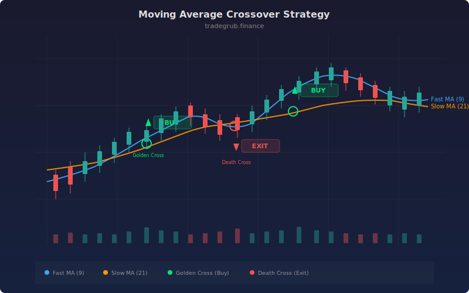

# Moving Average Crossover

The moving average crossover is one of the oldest and most widely used trend-following strategies in technical analysis. It uses two simple moving averages of different lengths to identify trend changes: when the faster average crosses above the slower one, upward momentum is building; when it crosses below, momentum is fading. Despite its simplicity, this strategy forms the foundation of many professional trend-following systems and remains effective on trending instruments across all timeframes.

## Conceptual Diagram



## How It Works

The strategy computes two simple moving averages using `ta.sma()`: a fast SMA (default 9 periods) that tracks recent price action closely, and a slow SMA (default 21 periods) that smooths out noise and represents the longer-term trend.

A buy signal triggers when the fast MA crosses above the slow MA, detected by `ta.crossover(fast_ma, slow_ma)`. This crossover indicates that short-term price momentum has shifted to the upside and is now exceeding the longer-term average, suggesting the start or continuation of an uptrend.

The position is closed when the fast MA crosses below the slow MA, detected by `ta.crossunder(fast_ma, slow_ma)`. This downward cross signals that short-term momentum has weakened below the longer-term trend, indicating the uptrend may be ending.

The strategy is long-only, making it suitable for equity markets that have a natural upward bias. The gap between the fast and slow period lengths determines sensitivity: closer periods (e.g., 9/13) generate more signals with more whipsaws, while wider gaps (e.g., 10/50) produce fewer but more reliable trend-change signals.

## Parameters

| Parameter | Default | Range | Description |
|-----------|---------|-------|-------------|
| Fast Period | 9 | 2-200 | Lookback for the fast SMA |
| Slow Period | 21 | 2-500 | Lookback for the slow SMA |

## Python Advantage

The entire strategy logic is expressed in four clean lines, with `ta.crossover` and `ta.crossunder` operating on full numpy arrays:

```python
fast_ma = ta.sma(close, fast_period)
slow_ma = ta.sma(close, slow_period)

# Crossover detection compares two full arrays element-wise
if ta.crossover(fast_ma, slow_ma):
    strategy.entry("Long", strategy.LONG)
if ta.crossunder(fast_ma, slow_ma):
    strategy.close("Long")
```

The `ta.sma()` function returns a complete numpy array of SMA values for every bar in the dataset, computed in a single vectorized call. In Pine, SMA is computed incrementally bar-by-bar. The Python approach allows pre-computing the entire moving average history, enabling downstream operations like slicing, statistical analysis, or parameter optimization over the full array without re-computation.

## When to Use

Moving average crossovers work best on daily and weekly charts for trending instruments: index ETFs, large-cap stocks, commodities, and forex majors. The strategy performs well during sustained directional moves and poorly in sideways, choppy markets where it generates frequent whipsaw signals. Widen the period gap (e.g., 20/50) for noisier instruments and tighten it (e.g., 5/13) for clean-trending assets.

## Risk Management

Place stop-losses below the slow MA at entry time or use a fixed ATR-based stop. The biggest risk with MA crossovers is whipsaw losses during range-bound markets, where the fast and slow MAs interleave repeatedly. Consider adding a minimum crossover magnitude filter or requiring the cross to hold for a confirmation bar. Position size conservatively since the strategy can endure strings of small losses before catching a large trend.

## Combining with Other Indicators

- **MACD Crossover**: MACD is derived from moving averages and can confirm crossover signals with histogram momentum.
- **Keltner Reversion**: After an MA crossover signals a trend change, use Keltner Channels to time pullback entries within the new trend.
- **Momentum Divergence**: Check for RSI divergence at crossover points to filter out low-conviction signals.
