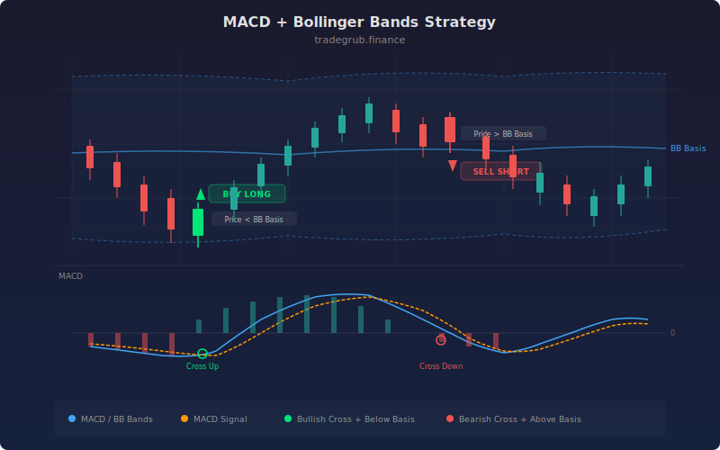

# MACD + Bollinger Bands

This strategy merges MACD momentum signals with Bollinger Band positioning to time entries where momentum shifts align with price extremes. The MACD crossover identifies the direction of momentum change, while the Bollinger Band position filters entries to only those occurring in the favorable half of the price range. A bullish MACD crossover below the Bollinger basis targets oversold reversals, and a bearish crossover above the basis targets overbought reversals.

## Conceptual Diagram



## How It Works

The strategy calculates the MACD system using `ta.macd()`, which returns three arrays: the MACD line (difference between fast and slow EMAs), the signal line (EMA of the MACD line), and the histogram (MACD minus signal). Separately, Bollinger Bands are computed with `ta.bb()`, producing upper, basis, and lower bands.

Long entries require two simultaneous conditions: the MACD line must cross above the signal line (bullish momentum shift), AND price must be at or below the Bollinger basis (middle band). This combination targets situations where momentum is turning positive while price is still in the lower half of its recent range, maximizing upside potential.

Short entries require the MACD line to cross below the signal line (bearish momentum shift) while price is at or above the Bollinger basis. This targets situations where momentum is turning negative and price is in the upper half of its range, maximizing downside potential.

Both conditions are computed as vectorized boolean arrays. The `ta.crossover` and `ta.crossunder` functions return boolean arrays for all bars, which are combined with the price-vs-basis condition using the `&` operator. The strategy iterates through the final combined signals to place entries.

## Parameters

| Parameter | Default | Range | Description |
|-----------|---------|-------|-------------|
| MACD Fast | 12 | 2-50 | Fast EMA period for MACD |
| MACD Slow | 26 | 10-100 | Slow EMA period for MACD |
| MACD Signal | 9 | 2-30 | Signal line EMA period |
| BB Length | 20 | 5-50 | Bollinger Bands lookback |
| BB Multiplier | 2.0 | 0.5-4.0 | Standard deviation multiplier |

## Python Advantage

Two complete indicator systems are computed and combined in vectorized boolean logic:

```python
# Two indicator systems, each returning full arrays
macd_line, signal_line, hist = ta.macd(close, macd_fast, macd_slow, macd_sig)
bb_upper, bb_basis, bb_lower = ta.bb(close, bb_len, bb_mult)

# Crossover arrays combined with price position filter
macd_bull = ta.crossover(macd_line, signal_line)
macd_bear = ta.crossunder(macd_line, signal_line)

long_cond = macd_bull & (close <= bb_basis)
short_cond = macd_bear & (close >= bb_basis)
```

Each `ta.macd()` and `ta.bb()` call returns multiple numpy arrays via tuple unpacking. The crossover detection and band comparison happen element-wise across the entire dataset. Pine requires separate variable assignments for each MACD and BB component, and conditions are evaluated serially on each bar. Python's approach allows rapid prototyping of different combination logic by simply changing the `&` expressions.

## When to Use

This strategy works well on 1-hour to daily timeframes for liquid stocks, ETFs, and forex pairs. It is most effective in markets that oscillate with periodic momentum shifts rather than grinding in one direction. The Bollinger Band filter prevents chasing momentum signals at price extremes, making it a good fit for range-bound to moderately trending conditions. Avoid using it during strong breakouts where MACD stays in one direction while price rides a Bollinger Band.

## Risk Management

Set stops beyond the Bollinger Band extreme opposite to the entry direction (lower band for longs, upper band for shorts). The distance from the basis to the band provides a natural risk gauge. Position size based on the current Bollinger Band width, as wider bands indicate higher volatility and require smaller positions. Consider taking partial profits when price reaches the opposite Bollinger Band.

## Combining with Other Indicators

- **MA Crossover**: Add a trend filter so MACD+BB entries only fire in the direction of the dominant trend.
- **Keltner Reversion**: Compare Keltner Channel signals with Bollinger Band positioning for dual-volatility confirmation.
- **Multi-Oscillator Consensus**: Layer RSI/CCI/Stochastic on top of the MACD cross for additional momentum validation.
