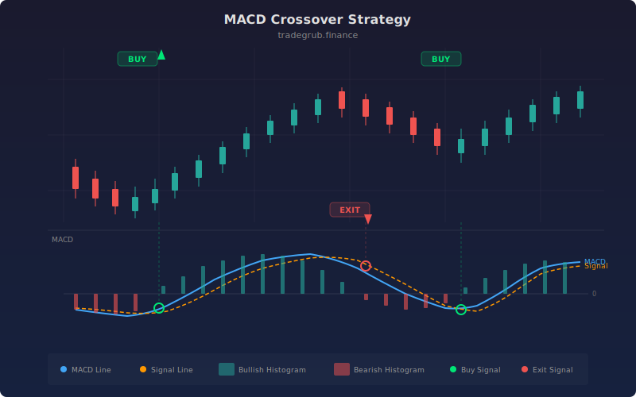

# MACD Crossover

The Moving Average Convergence Divergence (MACD), developed by Gerald Appel in the late 1970s, is one of the most popular momentum indicators in technical analysis. It measures the relationship between two exponential moving averages and generates signals when the MACD line crosses its signal line. This strategy implements the classic MACD crossover system: buy when the MACD line crosses above the signal line and exit when it crosses below. The MACD effectively combines trend-following and momentum analysis into a single indicator.

## Conceptual Diagram



## How It Works

The MACD is calculated by subtracting a slow EMA (default 26 periods) from a fast EMA (default 12 periods). When the fast EMA is above the slow EMA, the MACD line is positive, indicating upward momentum. The signal line is a 9-period EMA of the MACD line itself, providing a smoothed reference for crossover detection.

A buy signal fires when the MACD line crosses above the signal line, detected by `ta.crossover(macd_line, signal_line)`. This indicates that short-term momentum is accelerating relative to the longer-term trend, suggesting the beginning of a bullish move.

The position closes when the MACD line crosses below the signal line, detected by `ta.crossunder(macd_line, signal_line)`. This signals that upward momentum is decelerating and the bullish impulse may be ending.

The histogram (MACD minus signal) is also computed and available for visualization. Expanding histogram bars confirm momentum strength, while shrinking bars warn of an impending crossover. The strategy is long-only, using the crossover for entry and crossunder for exit.

## Parameters

| Parameter | Default | Range | Description |
|-----------|---------|-------|-------------|
| Fast Length | 12 | 2-100 | Fast EMA period |
| Slow Length | 26 | 2-200 | Slow EMA period |
| Signal Length | 9 | 2-50 | Signal line EMA period |

## Python Advantage

The entire MACD system is computed and unpacked in a single line, with crossover logic applied directly to the resulting arrays:

```python
# Complete MACD system in one call -- three arrays returned
macd_line, signal_line, histogram = ta.macd(close, fast_length, slow_length, signal_length)

# Crossover detection on full arrays
if ta.crossover(macd_line, signal_line):
    strategy.entry("Long", strategy.LONG)
if ta.crossunder(macd_line, signal_line):
    strategy.close("Long")
```

The `ta.macd()` function computes both EMAs, the MACD difference, the signal EMA, and the histogram in one vectorized operation. In Pine, these are computed incrementally on each bar. Python's tuple unpacking gives immediate access to all three components, and the histogram array can be used for further numpy analysis (e.g., finding histogram peaks, computing divergence, or running rolling statistics) without additional computation.

## When to Use

MACD crossover works best on daily charts for trending stocks, ETFs, indices, and forex pairs. The default 12/26/9 parameters are well-suited for capturing medium-term swings lasting 2-8 weeks. For faster signals, reduce the fast/slow periods (e.g., 8/17/9); for smoother, longer-term signals, increase them (e.g., 19/39/9). The strategy is less effective in choppy, range-bound markets where the MACD oscillates around zero without clear momentum.

## Risk Management

Place stops below the most recent swing low at the time of the crossover signal, or use a fixed 2x ATR stop from entry. MACD crossovers can lag significant moves since the signal is based on smoothed averages, so expect some slippage on both entry and exit. The histogram can provide early warnings: if bars are shrinking despite a long position, consider tightening your stop. Avoid averaging down on losing MACD positions since the crossunder exit signal should be respected.

## Combining with Other Indicators

- **MA Crossover**: MACD is derived from moving averages, so pairing it with a longer-term MA crossover (e.g., 50/200) provides trend alignment.
- **Bollinger Bands (MACD+BB)**: Use Bollinger Band positioning to filter MACD crosses to only those occurring at price extremes.
- **Mean Reversion ATR**: After a MACD crossover entry, use ATR bands to set dynamic profit targets.
