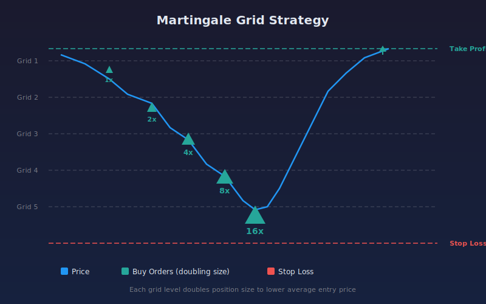

# Martingale Grid Strategy

Grid trading strategy with martingale position sizing. Places buy orders at percentage-based depth intervals below an initial entry. Each subsequent order size increases by a configurable multiplier. Take profit is calculated from the average entry price and stop loss is fixed from the first order price.

## Concept

## Parameters

| Parameter | Default | Range | Description |
|-----------|---------|-------|-------------|
| Grid Depth % | 1.5 | 0.5 - 5.0 | Percentage distance between each grid level |
| Martingale Multiplier | 1.5 | 1.0 - 4.0 | Order size multiplier for each subsequent level |
| Max Grid Orders | 6 | 2 - 12 | Maximum number of grid orders to place |
| Take Profit % | 2.0 | 0.5 - 10.0 | Take profit percentage above average entry price |
| Stop Loss % | 10.0 | 2.0 - 30.0 | Stop loss percentage below first entry price |
| SMA Length | 50 | 10 - 200 | Simple moving average period for entry signal |

## How It Works

1. An initial long entry triggers when price crosses below the SMA, signaling a pullback.
2. Additional buy orders are placed at each grid level, spaced by the Grid Depth percentage below the first entry.
3. Each grid order is larger than the previous by the Martingale Multiplier (e.g., 1x, 1.5x, 2.25x, 3.375x ...).
4. The take profit target is recalculated after each fill based on the new average entry price.
5. The stop loss remains fixed at the configured percentage below the first entry price.
6. The position closes when either the take profit or stop loss is reached.

## Chart Annotations

- **Blue label (G1 ENTRY):** Initial grid entry point
- **Orange labels (G2, G3, ...):** Subsequent grid fill levels
- **Green dashed line:** Take profit level
- **Red dashed line:** Stop loss level
- **Orange dotted lines:** Pending grid order levels

## Risk Warning

This strategy uses martingale position sizing, which increases exposure as price moves against you. Total position size grows exponentially with each grid level filled. With default settings (multiplier 1.5, max 6 orders), full grid exposure is approximately 15x the initial order size. This strategy is intended for testing and educational purposes. Use appropriate position sizing and risk management.
