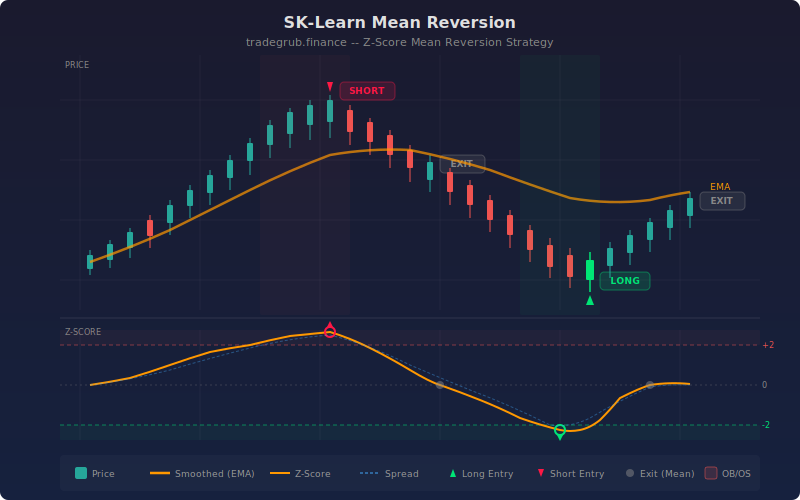

# Statistical Mean Reversion

Statistical mean-reversion strategy that constructs a synthetic pair from price and its smoothed version, then uses scikit-learn linear regression to compute the optimal hedge ratio. Trades are triggered when the z-score of the resulting spread reaches statistical extremes, betting on reversion to the mean.

## Conceptual Diagram



## How It Works

The strategy creates a synthetic spread by comparing the raw close price against its exponential moving average (EMA). Rather than assuming a 1:1 relationship, it uses sklearn LinearRegression to fit the optimal hedge ratio between the two series. The spread is then computed as: spread = close - hedge_ratio * EMA(close). This regression-based approach adapts to the actual statistical relationship and produces a more stationary spread than naive subtraction.

A rolling z-score is calculated over the spread using a configurable lookback window. The z-score measures how many standard deviations the current spread sits from its rolling mean. When the z-score drops below the negative entry threshold (default -2.0), the strategy enters long, expecting the spread to revert upward. When the z-score rises above the positive entry threshold (+2.0), it enters short. Positions are closed when the z-score crosses back through the exit level (default 0.0), indicating the spread has returned to its mean.

An ATR-based stop loss provides risk management for cases where mean reversion fails. The stop is placed at a configurable multiple of ATR from the entry price. This protects against regime changes or trending markets where the spread may diverge rather than revert.

## Parameters

| Parameter | Default | Range | Description |
|-----------|---------|-------|-------------|
| Smoothing Period | 50 | 10-200 | EMA length for the smoothed price series |
| Z-Score Lookback | 20 | 5-100 | Rolling window for z-score mean and standard deviation |
| Entry Z-Score | 2.0 | 0.5-4.0 | Z-score threshold to trigger entries |
| Exit Z-Score | 0.0 | -1.0-1.0 | Z-score level to close positions (mean reversion target) |
| ATR Length | 14 | 5-50 | Period for Average True Range calculation |
| ATR Stop Multiple | 3.0 | 1.0-6.0 | Stop loss distance as a multiple of ATR |
| Show Labels | True | -- | Display entry/exit labels on chart |
| Show Entry/Stop Levels | True | -- | Draw entry and stop loss level lines |

## Signals

**Long entry:** Z-score falls below the negative entry threshold, indicating the price is statistically cheap relative to its smoothed version.

**Short entry:** Z-score rises above the positive entry threshold, indicating the price is statistically expensive relative to its smoothed version.

**Exit:** Z-score crosses back through the exit level (default 0), or the ATR-based stop loss is hit.

**Background shading:** Red tint when z-score is in the overbought zone (above entry threshold), green tint when in the oversold zone (below negative entry threshold).

## Python Advantage

Scikit-learn provides a robust, numerically stable linear regression that handles edge cases and collinearity:

```python
from sklearn.linear_model import LinearRegression

close_arr = np.array(close, dtype=float).reshape(-1, 1)
smooth_arr = np.array(smoothed, dtype=float).reshape(-1, 1)

reg = LinearRegression()
reg.fit(smooth_arr, close_arr)
hedge_ratio = float(reg.coef_[0][0])

spread = close - hedge_ratio * smoothed
```

The fitted hedge ratio adapts to the actual price-vs-smoothed relationship rather than assuming a fixed 1:1 ratio.

## Usage Notes

This strategy works best on instruments that exhibit mean-reverting behavior on the chosen timeframe. Stocks in ranges, ETFs, and forex pairs tend to mean-revert more reliably than trending commodities or momentum stocks. Use daily or 4-hour timeframes for the most stable z-score readings. Shorter timeframes increase signal frequency but may produce noisier spreads.

Increase the smoothing period on higher-volatility instruments to produce a more stable baseline. Widen the entry z-score threshold (e.g. 2.5 or 3.0) to filter out weak signals and only trade extreme deviations.

## Risk Management

Mean reversion strategies carry the risk of catching a falling knife or selling into a breakout. The ATR stop loss (default 3x ATR) provides a hard exit for when the spread fails to revert. Size positions based on the stop distance, not on conviction about reversion. If the spread regime changes (e.g. a structural break in the price-smoothed relationship), the hedge ratio from historical data may no longer apply.

## Combining with Other Indicators

- **Volume Climax Alert**: Volume spikes at z-score extremes suggest capitulation and increase the probability of mean reversion
- **Momentum Rank**: Avoid mean-reversion entries when momentum is strongly trending in the opposite direction
- **Consolidation Quality Score**: High-quality consolidation near z-score zero confirms the mean-reversion cycle has completed
- **Volatility Percentile**: Higher volatility regimes tend to produce wider z-score swings and more profitable mean-reversion trades
