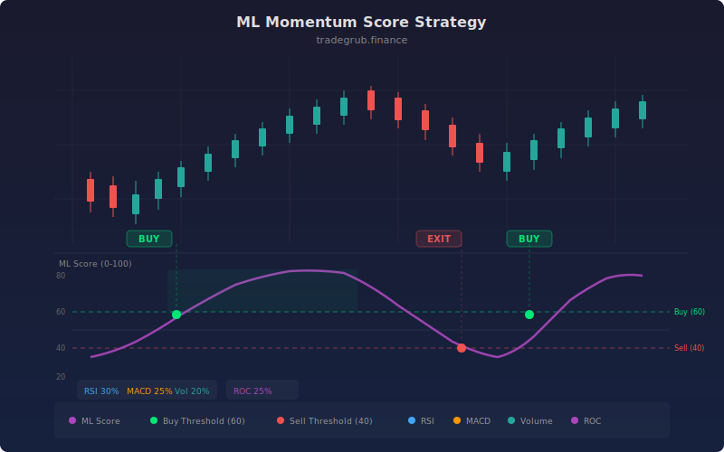

# ML Momentum Score

This strategy computes a composite momentum score from 0 to 100 by blending four normalized technical features: RSI momentum, MACD histogram strength, volume ratio, and multi-period rate of change. Each feature is weighted and combined into a single "ML Score" that quantifies the overall bullish or bearish conviction of the current market state. The approach borrows from machine learning feature engineering, where raw indicators are normalized to a common scale and linearly combined, producing a clean signal that is more robust than any single indicator.

## Conceptual Diagram



## How It Works

The strategy computes four raw features from price and volume data. RSI is calculated over a configurable period (default 14) and normalized to a -1 to +1 range by subtracting 50 and dividing by 50. The MACD histogram is normalized by dividing by ATR, making it comparable across instruments with different price scales. Volume ratio is the current volume divided by its 20-period SMA, normalized to center on zero. Rate of change combines 5-period and 10-period ROC, divided by 20 for scaling.

These four normalized features are combined with fixed weights: RSI (0.30), MACD (0.25), volume (0.20), and ROC (0.25). The weighted sum is scaled to a 0-100 range by the formula `50 + 25 * weighted_sum`, then clipped to [0, 100] using `np.clip`.

The resulting score represents market momentum conviction. Scores above the buy threshold (default: 0.6 * 100 = 60) trigger long entries. Scores below the sell threshold (default: (1 - 0.6) * 100 = 40) trigger exits. The thresholds are derived from the configurable `threshold` parameter, creating a symmetric band around the 50 midpoint.

The score is plotted as a continuous line with dashed threshold levels, giving a visual gauge of momentum strength that is easier to interpret than individual oscillators.

## Parameters

| Parameter | Default | Range | Description |
|-----------|---------|-------|-------------|
| Training Lookback | 200 | 50-500 | Historical bars for context (reserved for future adaptive weighting) |
| Signal Threshold | 0.6 | 0.5-0.9 | Score threshold for entries (buy above threshold*100, exit below (1-threshold)*100) |
| RSI Period | 14 | 5-50 | RSI calculation period |
| MACD Fast | 12 | 5-30 | Fast EMA for MACD |
| MACD Slow | 26 | 15-50 | Slow EMA for MACD |

## Python Advantage

This strategy showcases Python's strength in feature engineering and composite scoring, using numpy operations that have no equivalent in Pine:

```python
# Feature normalization -- centering and scaling for comparability
norm_rsi = (rsi_val - 50) / 50
norm_macd = hist / ta.atr(high, low, close, 14)
norm_vol = (vol_ratio - 1) / 2
norm_roc = (roc5 + roc10) / 20

# Weighted composite score -- linear combination with numpy broadcasting
score = 50 + 25 * (0.3 * norm_rsi + 0.25 * norm_macd + 0.2 * norm_vol + 0.25 * norm_roc)

# np.clip constrains to valid range -- vectorized across all bars
score = np.clip(score, 0, 100)
```

The normalization arithmetic operates on full numpy arrays element-wise. The weighted sum `0.3 * norm_rsi + 0.25 * norm_macd + ...` combines four arrays with broadcasting in a single expression. `np.clip` constrains every element to [0, 100] without a loop. Pine lacks array-level clipping and cannot perform multi-array weighted sums in one statement. Python also enables easy experimentation with different weights, additional features, or non-linear scoring functions.

## When to Use

The ML Momentum Score works well on 4-hour and daily timeframes for stocks, ETFs, and futures. It is designed for markets where multiple momentum signals should agree before committing capital. The composite approach smooths out noise from individual indicators, making it effective in moderately volatile markets. It is less useful in markets dominated by a single factor (e.g., pure volume-driven moves) where the multi-feature blending may dilute the strongest signal.

## Risk Management

The threshold parameter controls trade selectivity: higher thresholds (0.7-0.8) produce fewer but higher-conviction trades, while lower thresholds (0.5-0.6) are more active. Place stops using ATR-based levels since the strategy itself does not define fixed stops. Monitor the score trajectory: a score that rises sharply to the buy threshold and stalls may indicate a false breakout. The strategy is long-only, so ensure you have a separate risk management system for bear market conditions.

## Combining with Other Indicators

- **Ichimoku Cloud**: Use the Ichimoku cloud as a trend filter, only taking ML Score entries when price is above the cloud.
- **Mean Reversion ATR**: Use ATR bands to define take-profit targets once an ML Score entry triggers.
- **Pin Bar Reversal**: Look for candlestick confirmation patterns when the ML Score crosses a threshold, adding price action validation.
