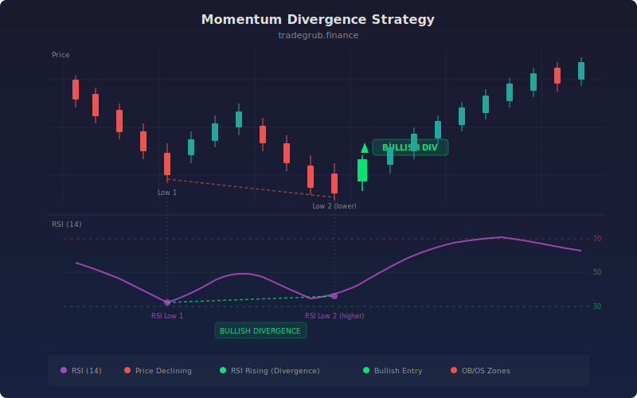

# Momentum Divergence

Divergence between price and the Relative Strength Index (RSI) is one of the most reliable reversal signals in technical analysis. When price makes a new low but RSI makes a higher low, the underlying selling pressure is weakening despite the lower price, creating bullish divergence. Conversely, when price makes a new high but RSI makes a lower high, buying pressure is fading, creating bearish divergence. This strategy automates divergence detection by comparing price and RSI extremes over a configurable lookback window.

## Conceptual Diagram



## How It Works

The strategy computes RSI over a configurable period (default 14) and then finds the lowest price and lowest RSI over a lookback window (default 20 bars) using `ta.lowest()`, as well as the highest price and highest RSI using `ta.highest()`.

Bullish divergence is detected when three conditions are true on the current bar: the current close is at or below the lookback low price (`close[-1] <= price_low[-1]`), the current RSI is above the previous lookback low RSI (`rsi[-1] > rsi_low[-2]`), and the current RSI is below the oversold level (default 30). The RSI comparison uses `[-2]` to compare against the prior bar's lookback low, ensuring the RSI is indeed making a higher low relative to the previous extreme.

Bearish divergence is the mirror: the current close is at or above the lookback high price, the current RSI is below the previous lookback high RSI, and the current RSI is above the overbought level (default 70).

Long entries fire on bullish divergence, and positions close on bearish divergence. The strategy is long-only, using divergence at oversold levels as entry points and divergence at overbought levels as exits.

## Parameters

| Parameter | Default | Range | Description |
|-----------|---------|-------|-------------|
| RSI Length | 14 | 2-50 | RSI calculation period |
| Divergence Lookback | 20 | 5-50 | Window for finding price and RSI extremes |
| Overbought | 70 | 60-90 | RSI level above which bearish divergence is valid |
| Oversold | 30 | 10-40 | RSI level below which bullish divergence is valid |

## Python Advantage

The strategy uses `ta.lowest` and `ta.highest` to compute rolling extremes as full arrays, then compares current values against prior-bar extremes using numpy indexing:

```python
# Rolling extremes computed as full arrays
price_low = ta.lowest(close, lookback)
rsi_low = ta.lowest(rsi, lookback)
price_high = ta.highest(close, lookback)
rsi_high = ta.highest(rsi, lookback)

# Divergence detection using array indexing
# [-1] = current bar, [-2] = prior bar
bullish_div = (close[-1] <= price_low[-1] and
               rsi[-1] > rsi_low[-2] and
               rsi[-1] < os_level)

bearish_div = (close[-1] >= price_high[-1] and
               rsi[-1] < rsi_high[-2] and
               rsi[-1] > ob_level)
```

The `ta.lowest(rsi, lookback)` call returns an array where each element is the minimum RSI over the preceding lookback bars, computed vectorially. The `[-2]` vs `[-1]` indexing elegantly compares the current RSI against the prior bar's rolling low to detect a higher low. In Pine, this requires explicit tracking of pivot levels and manual comparison logic across bars.

## When to Use

Divergence trading works best on daily and weekly charts where the patterns have more statistical significance. It suits stocks, ETFs, and forex pairs at major support and resistance levels. Divergence signals are reversal signals, so they are most effective at the end of extended trends rather than during choppy, trendless periods. The lookback period should be adjusted to match the typical cycle length of the instrument.

## Risk Management

Place stops below the most recent swing low for bullish divergence entries, or above the swing high for bearish exits. Divergence signals can precede the actual reversal by several bars, so be prepared for continued adverse movement before the reversion takes hold. Position size conservatively since divergence trades are counter-trend by nature. Consider requiring a second confirmation (such as a trendline break or candlestick pattern) before committing full size.

## Combining with Other Indicators

- **MA Crossover**: Wait for the MA crossover to confirm the trend change after divergence appears, using divergence as an early warning and the crossover as the trigger.
- **Keltner Reversion**: Divergence at a Keltner Channel extreme provides dual confirmation of an overextended move ready to revert.
- **Pin Bar Reversal**: A pin bar at the same price level as RSI divergence creates a powerful multi-factor reversal setup.
