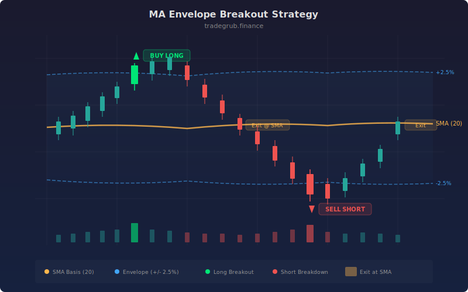

# MA Envelope Breakout

Moving Average Envelopes create a channel around a simple moving average by adding and subtracting a fixed percentage. Unlike Bollinger Bands which adapt their width to volatility, envelopes maintain a constant percentage distance from the MA, making breakouts through the envelope a stronger signal of genuine momentum. This strategy enters long when price breaks above the upper envelope (breakout) and short when price breaks below the lower envelope (breakdown), with exits at the SMA basis.

## Conceptual Diagram



## How It Works

The strategy computes a simple moving average (default 20 periods) as the center line. The upper envelope is calculated as `basis * (1 + pct / 100)` and the lower envelope as `basis * (1 - pct / 100)`, where `pct` defaults to 2.5%. This creates a fixed-percentage channel that tracks the moving average.

Long entries trigger when price crosses above the upper envelope, detected by `ta.crossover(close, upper)`. This breakout indicates that price has pushed through the normal fluctuation zone and strong upward momentum is present.

Short entries trigger when price crosses below the lower envelope, detected by `ta.crossunder(close, lower)`. This breakdown indicates strong downward momentum pushing price below the normal range.

Both positions exit at the SMA basis: longs close when price crosses below the basis, and shorts close when price crosses above the basis. The basis acts as the equilibrium target. This means the strategy captures the move from the envelope breakout back to (and potentially through) the mean, rather than holding for a move to the opposite envelope.

## Parameters

| Parameter | Default | Range | Description |
|-----------|---------|-------|-------------|
| MA Length | 20 | 5-200 | SMA period for the center line |
| Envelope Percent | 2.5 | 0.5-10.0 | Percentage distance from MA to envelope edges |

## Python Advantage

The envelope computation uses numpy's broadcasting with percentage arithmetic on full arrays:

```python
basis = ta.sma(close, length)

# Percentage-based envelope -- vectorized across all bars
upper = basis * (1 + pct / 100)
lower = basis * (1 - pct / 100)

# Breakout and breakdown detection on computed arrays
if ta.crossover(close, upper)[-1]:
    strategy.entry("Long", strategy.LONG)
if ta.crossunder(close, lower)[-1]:
    strategy.entry("Short", strategy.SHORT)

# Mean-reversion exit at basis
if ta.crossunder(close, basis)[-1]:
    strategy.close("Long")
if ta.crossover(close, basis)[-1]:
    strategy.close("Short")
```

The expression `basis * (1 + pct / 100)` multiplies every element of the SMA array by the same scalar, producing the full upper envelope history in one operation. Python also makes it straightforward to convert to dynamic percentage envelopes (e.g., using ATR-derived percentages per bar) by replacing the scalar with an array, a refactor that would require a complete rewrite in Pine.

## When to Use

MA Envelopes work best on daily charts for stocks, ETFs, and forex pairs that trend with periodic pullbacks and breakouts. The fixed-percentage channel is most useful when volatility is relatively stable; in markets with rapidly changing volatility, consider adjusting the percentage or switching to ATR-based bands. The strategy performs well in momentum-driven markets where breakouts from the envelope are followed by sustained moves. Tighten the percentage (1.0-1.5%) for low-volatility instruments and widen it (3.0-5.0%) for volatile ones.

## Risk Management

Place stops just inside the envelope that was broken (e.g., slightly below the upper envelope for a long breakout). If price re-enters the envelope without reaching the basis, it may be a false breakout, and the stop will limit damage. The maximum loss per trade is the distance from the entry at the envelope to the stop. Ensure the expected move to the basis provides at least a 1.5:1 reward-to-risk ratio before entering.

## Combining with Other Indicators

- **MACD Crossover**: Confirm envelope breakouts with MACD momentum direction to filter out weak breakouts.
- **Narrow Range Breakout**: NR7 compression inside the envelope can precede explosive breakouts through the envelope boundary.
- **Mean Reversion ATR**: Compare envelope breakout signals with ATR band extremes for dual-channel validation.
