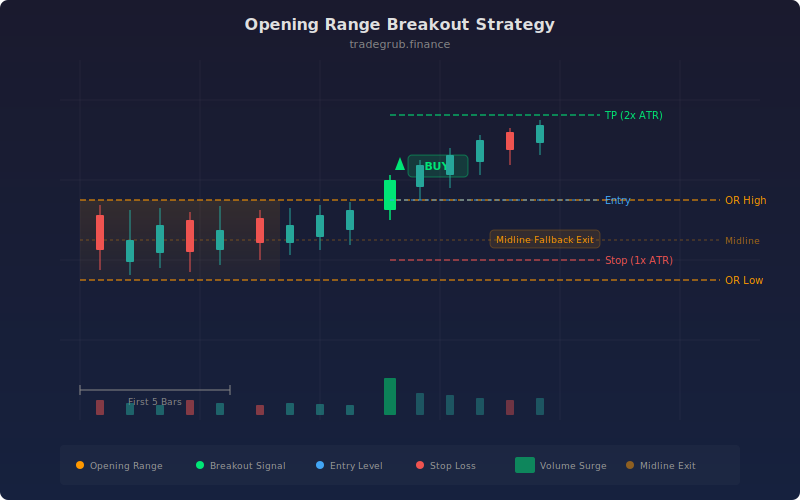

# Opening Range Breakout

A classic intraday breakout strategy that defines a price range from the first N bars of a session and trades the directional breakout when price crosses above or below that range. The opening range concept was pioneered by traders like Toby Crabel and Mark Fisher, based on the observation that the early price action in a session often sets the tone for the rest of the day. This implementation adds ATR-based exits and a midline fallback to manage risk.

## Conceptual Diagram



## How It Works

The strategy calculates the opening range by finding the highest high and lowest low over the first N bars (default 5). These levels form a channel that represents the initial battle between buyers and sellers. A midline is calculated as the average of the opening range high and low.

A long entry triggers when the closing price crosses above the opening range high, indicating that buyers have won the early session battle and momentum is shifting upward. A short entry fires when price crosses below the opening range low, signaling seller dominance. The `ta.crossover` and `ta.crossunder` functions ensure signals fire only at the moment of the break, not on every bar that remains outside the range.

Exits use a dual approach. The primary exit is ATR-based: take profit is set at 2.0 times ATR from entry, and stop loss at 1.0 times ATR. As a secondary fallback, long positions are closed if price crosses back below the midline, and short positions are closed if price crosses back above it. This midline exit prevents trades from sitting in limbo when the breakout stalls without hitting either the profit target or stop loss.

The opening range is shaded on the chart between the high and low levels, with the midline drawn in orange. Triangle markers appear at breakout points for visual clarity.

## Parameters

| Parameter | Default | Range | Description |
|-----------|---------|-------|-------------|
| Opening Range Bars | 5 | 1 - 30 | Number of bars used to define the opening range |
| ATR Length | 14 | 5 - 50 | Lookback for ATR calculation |
| ATR Take Profit Multiplier | 2.0 | 1.0 - 5.0 | ATR multiple for profit target |
| ATR Stop Loss Multiplier | 1.0 | 0.5 - 3.0 | ATR multiple for stop loss |

## Python Advantage

Python enables combining crossover detection with ATR-based exit calculations and midline fallback logic in a clean, readable flow. The midline exit uses array-level crossover detection and conditional closing that would require verbose workarounds in other scripting languages:

```python
or_high = ta.highest(high, or_bars)
or_low = ta.lowest(low, or_bars)
or_mid = (or_high + or_low) / 2

long_signal = ta.crossover(close, or_high)
short_signal = ta.crossunder(close, or_low)

# Midline fallback exits
if ta.crossunder(close, or_mid)[-1]:
    strategy.close("Long")
if ta.crossover(close, or_mid)[-1]:
    strategy.close("Short")
```

The ability to combine `strategy.exit()` for ATR targets with `strategy.close()` for midline exits gives layered exit logic that is difficult to replicate cleanly in other scripting environments.

## When to Use

Designed primarily for intraday trading on 5-minute to 15-minute charts. Works well on liquid stocks, futures, and forex pairs during sessions with clear opening activity. The strategy performs best on days with directional moves rather than range-bound chop. Adjust the Opening Range Bars parameter based on your timeframe: fewer bars for faster entries, more bars for a wider and more reliable range definition.

## Risk Management

The ATR-based stop loss provides volatility-adaptive protection. The midline fallback exit adds a safety net for stalled breakouts. Keep position sizes modest since intraday breakouts can reverse quickly, especially around news events. Avoid trading the opening range on days with major economic releases scheduled before the range completes, as the range itself may be distorted. A known limitation is that in very narrow opening ranges, breakouts can trigger on insignificant moves.

## Combining with Other Indicators

- **VWAP Bounce**: Confirm that the breakout direction aligns with VWAP position (price above VWAP for longs, below for shorts).
- **Squeeze Momentum**: Use squeeze momentum to verify that volatility is expanding after the opening range, confirming a genuine breakout rather than a false start.
- **ATR Trailing Stop**: Replace the fixed ATR exit with a trailing stop to capture extended intraday trends after the initial breakout.
