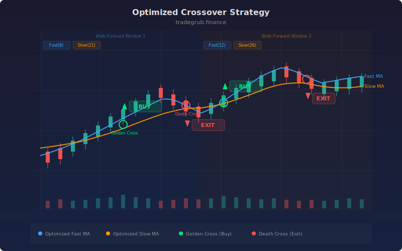

# Optimized Crossover Strategy

Walk-forward moving average crossover that periodically re-optimizes its fast and slow periods using scipy bounded minimization on a trailing training window. Every N bars, the strategy finds the fast MA length that maximized P&L over the most recent training data, then uses 3x that length as the slow MA. This lets the crossover system adapt to changing market regimes without manual parameter tuning.

## Concept

## Parameters

- **Training Window**: Bars used for optimization (default: 100)
- **Re-optimize Every**: Bars between re-optimizations (default: 50)
- **ATR Length**: ATR for stops (default: 14)
- **Stop ATR Mult**: Stop distance (default: 2.0)

## Signals

- **Long/Short**: Optimized MA crossover signals
- **Walk-forward**: Periods adapt to recent market conditions
