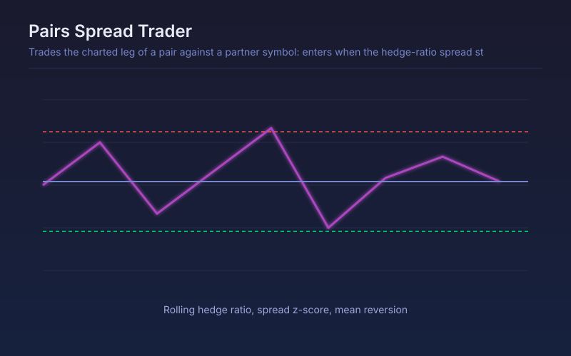

# Pairs Spread Trader

Trades the charted leg of a pair against a partner symbol: enters when the hedge-ratio spread stretches by a z-score threshold and exits as it reverts.

## Conceptual Diagram

## Parameters

| Parameter | Default | Range | Description |
|-----------|---------|-------|-------------|
| Partner symbol | SPY | any symbol | Second leg of the pair, fetched on the chart timeframe |
| Spread window | 60 | 20-400 | Bars used for the rolling hedge ratio and z-score |
| Entry z-score | 2.0 | 0.5-5.0 | How far the spread must stretch before a position is opened |
| Exit z-score | 0.5 | 0.0-3.0 | Reversion level that closes the position |
| Stop z-score | 4.0 | 1.0-10.0 | Divergence level that admits the relationship has broken and stops out |

## Signals

- Long: the spread is cheap by the entry z-score, meaning the charted leg has underperformed its hedge
- Short: the spread is rich by the same measure
- Exit: the spread reverts inside the exit band
- Stop: the spread keeps widening past the stop band, which usually means the relationship itself has changed

## Usage

Use on genuinely related instruments, such as two names in one sector or an ETF against its largest holding, and check cointegration first with the Mean Reversion Detector. Only the charted leg is traded: the backtester holds one symbol at a time, so the partner drives the signal rather than being bought and sold itself.
