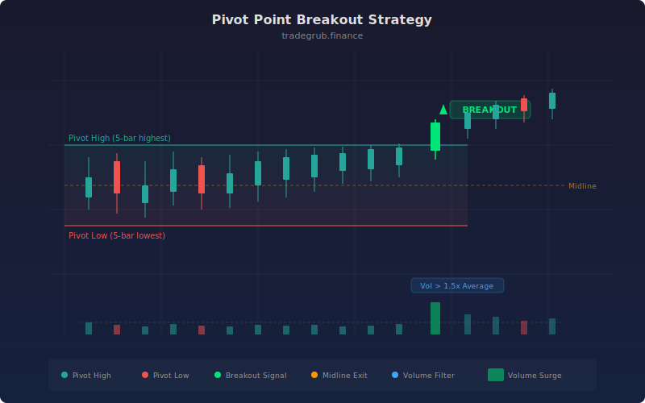

# Pivot Point Breakout

A support and resistance breakout strategy that identifies dynamic pivot levels using rolling highest highs and lowest lows, then trades breakouts beyond those levels with optional volume confirmation. Pivot points have been a staple of floor trader analysis for decades, representing key price levels where supply and demand are concentrated. This implementation automates the detection and trading of breakouts from these levels.

## Conceptual Diagram



## How It Works

The strategy calculates rolling pivot highs and pivot lows using `ta.highest` and `ta.lowest` over a configurable lookback period (default 5 bars). These levels represent the recent ceiling and floor of price action. A midline is calculated as the average of the two.

A long entry triggers when the closing price exceeds the pivot high and the volume confirmation condition is met. By default, volume must exceed 1.5 times the 20-period average volume, confirming that the breakout has institutional participation rather than being a low-volume drift. A short entry fires under the mirror conditions: close below pivot low with volume confirmation.

Exits are based on the midline. When a long position sees price cross back below the midline, the position is closed. Similarly, short positions exit when price crosses above the midline. This mid-range exit captures the momentum portion of the breakout move without waiting for a full reversal back to the opposite pivot level.

The volume filter is optional and can be toggled off for instruments or timeframes where volume data is unreliable. When disabled, entries trigger purely on price breakouts. The pivot high and low are plotted as green and red lines with the zone between them shaded, and breakout signals are marked with triangle shapes.

## Parameters

| Parameter | Default | Range | Description |
|-----------|---------|-------|-------------|
| Pivot Lookback | 5 | 2 - 20 | Number of bars for highest/lowest calculation |
| Confirmation Bars | 2 | 1 - 5 | Bars of confirmation required (reserved for future use) |
| Require Volume Confirmation | true | true/false | Whether to require above-average volume |
| Volume Multiplier | 1.5 | 1.0 - 3.0 | Multiple of 20-period average volume required |

## Python Advantage

Python allows the volume filter to be applied as a conditional boolean mask that integrates cleanly with the breakout detection, and the conditional creation of the volume array uses a ternary expression:

```python
avg_vol = ta.sma(volume, 20)
vol_confirm = volume > avg_vol * vol_mult if use_volume else np.ones(len(close), dtype=bool)

long_signal = (close > pivot_high) & vol_confirm
short_signal = (close < pivot_low) & vol_confirm
```

The `np.ones` fallback when volume filtering is disabled creates a boolean array of all `True` values, allowing the same logical expression to work regardless of the filter setting without branching code paths.

## When to Use

Effective on daily and weekly charts for swing trading equities, ETFs, and futures. The pivot breakout approach works best in markets that alternate between consolidation and trend phases. The volume filter is particularly valuable on equity markets where volume data is reliable. For forex or crypto where volume data may be tick-based or exchange-specific, consider disabling the volume requirement or reducing the multiplier.

## Risk Management

The midline exit provides a natural profit-taking level but no explicit stop loss. Consider adding an ATR-based stop below the pivot low for longs (or above pivot high for shorts) to cap maximum loss per trade. Position size based on the distance from entry to your stop level. Be cautious with very short lookback periods (2-3 bars), as the pivot levels will be too tight and generate excessive false breakouts. Longer lookback periods produce wider pivots that require larger moves to break, naturally reducing signal frequency.

## Combining with Other Indicators

- **ATR Trailing Stop**: Add a trailing stop to protect profits on breakout moves that extend well beyond the pivot level.
- **ADX Trend Filter**: Require ADX above 20 before taking breakout signals to ensure the market has directional momentum.
- **Pin Bar Reversal**: Look for pin bar reversals at pivot levels that fail to break, trading the rejection for a counter-trend move back to the midline.
