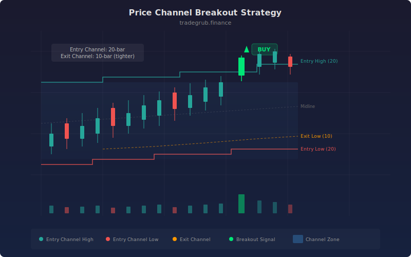

# Price Channel Breakout

A trend-following channel strategy inspired by the Donchian Channel system, famously used by the Turtle Traders in the 1980s. The strategy enters positions when price breaks the highest high or lowest low of a lookback period and exits using a shorter channel in the opposite direction. This dual-channel approach captures trending moves while using a tighter exit channel to lock in profits as the trend matures.

## Conceptual Diagram



## How It Works

The strategy maintains two sets of channels: an entry channel and an exit channel. The entry channel is the highest high and lowest low over a longer lookback (default 20 bars). The exit channel uses a shorter lookback (default 10 bars) for faster reaction to price pullbacks.

A long entry triggers when the current close exceeds the previous bar's entry channel high, meaning price has broken above the highest high of the last 20 bars. This represents a fresh high and suggests upward momentum. A short entry triggers when the close falls below the previous bar's entry channel low.

Exits use the shorter channel in the opposite direction. A long position is closed when price drops below the previous bar's exit channel low (10-bar lowest low). A short position is closed when price rises above the exit channel high. By comparing against the previous bar's channel values (using index [-2]), the strategy avoids the look-ahead bias of comparing against levels that include the current bar.

The midline, calculated as the average of the entry channel high and low, is plotted for reference but is not used in the trading logic. The channel zone is shaded between the entry high and low for visual clarity.

The asymmetry between the longer entry channel and shorter exit channel is intentional. The wider entry channel requires a significant move to trigger, filtering out noise. The tighter exit channel responds more quickly to reversals, protecting accumulated profits.

## Parameters

| Parameter | Default | Range | Description |
|-----------|---------|-------|-------------|
| Entry Channel Length | 20 | 5 - 100 | Lookback period for the entry channel (highest high / lowest low) |
| Exit Channel Length | 10 | 3 - 50 | Lookback period for the exit channel |

## Python Advantage

The strategy logic is remarkably clean in Python thanks to direct array indexing. Comparing the current bar's close against the previous bar's channel level is a simple index operation:

```python
highest_high = ta.highest(high, entry_length)
lowest_low = ta.lowest(low, entry_length)

exit_high = ta.highest(high, exit_length)
exit_low = ta.lowest(low, exit_length)

# Previous bar comparison avoids look-ahead bias
if close[-1] > highest_high[-2]:
    strategy.entry("Long", strategy.LONG)

if close[-1] < exit_low[-2]:
    strategy.close("Long")
```

Python's negative indexing (`[-1]` for current bar, `[-2]` for previous) is intuitive and eliminates off-by-one errors that are common with bracket-based history references.

## When to Use

The price channel breakout is a pure trend-following system, best suited for markets that exhibit sustained directional moves: commodity futures, forex majors, and trending large-cap stocks. Use daily or weekly charts for the classic Turtle-style approach. Shorter timeframes work but require tighter channel lengths. This strategy underperforms in choppy, mean-reverting markets where breakouts consistently fail.

## Risk Management

The exit channel acts as a built-in trailing stop, so explicit stop-loss levels are not strictly necessary. However, the initial risk on a trade (distance from entry to the exit channel at time of entry) can be large with a 20-bar entry channel. Size positions so that this initial risk represents no more than 1-2% of capital. A known limitation is that long channel lengths produce infrequent signals, and the strategy can sit flat for extended periods. This is by design for trend-following but requires patience and discipline.

## Combining with Other Indicators

- **ADX Trend Filter**: Add an ADX threshold to confirm that a genuine trend is forming before taking the channel breakout, reducing whipsaws in ranging markets.
- **ATR Trailing Stop**: Replace the fixed exit channel with an ATR-based trailing stop for more adaptive profit protection in volatile markets.
- **Supertrend**: Use supertrend direction as a secondary confirmation that the broader trend supports the channel breakout direction.
