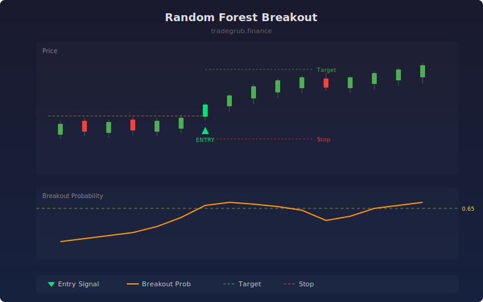

# Random Forest Breakout

Trains a random forest ensemble on volume, volatility, and price pattern features to score breakout probability in real time. When the probability crosses above the threshold, it enters long positions with ATR-based stop-loss and take-profit levels.

## How It Works

- Extracts features: range position (price within recent high-low range), volume ratio, ATR ratio, and 5-bar return
- Trains a random forest classifier on a rolling window to predict significant upward breakouts
- Generates entry signals when breakout probability crosses above the configurable threshold
- Sets stop-loss and take-profit using ATR multiples for adaptive risk management
- Exits when breakout probability drops below 0.4, indicating fading momentum

## Parameters

| Parameter | Default | Range | Description |
|-----------|---------|-------|-------------|
| Lookback Length | 20 | 10-50 | Period for ATR, highest, lowest calculations |
| Number of Trees | 50 | 10-200 | Trees in the random forest ensemble |
| Training Window | 80 | 40-150 | Rolling training window size |
| Probability Threshold | 0.65 | 0.50-0.90 | Minimum breakout probability for entry |
| ATR Stop Multiple | 2.0 | 1.0-5.0 | ATR multiplier for stop-loss distance |

## Outputs

- **Breakout Signal**: Green triangle below bar on entry signals
- **Breakout Probability**: Orange line showing real-time breakout probability (0 to 1)

## Usage Notes

- Higher probability thresholds produce fewer but higher-confidence signals
- Increase the number of trees for more stable predictions at the cost of computation time
- Works best on liquid instruments with clear breakout patterns
