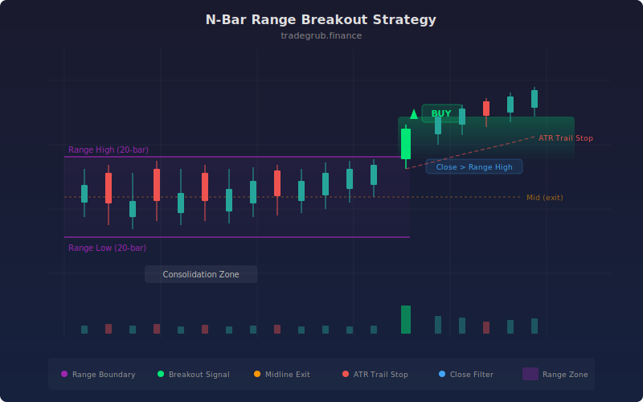

# N-Bar Range Breakout

The N-Bar Range Breakout strategy identifies consolidation zones by tracking the highest high and lowest low over a configurable lookback period, then trades the directional breakout when price escapes the range. This technique is rooted in the Donchian channel methodology pioneered by Richard Donchian in the 1960s, adapted here with ATR-based trailing stops and an optional close-confirmation filter to reduce false breakouts caused by intrabar wicks.

## Conceptual Diagram



## How It Works

The strategy computes a rolling N-bar channel using `ta.highest(high, length)` for the upper boundary and `ta.lowest(low, length)` for the lower boundary. A midline is derived as the average of these two extremes. This channel defines the recent consolidation range, and the strategy waits for price to convincingly escape it.

When the `use_close_filter` option is enabled (the default), entries require the closing price to cross above the range high for longs, or below the range low for shorts. This prevents false signals from wicks that briefly pierce the boundary but fail to sustain direction. When the filter is disabled, the raw high/low values are used for faster but noisier entries.

Exits are dual-layered. The primary exit triggers when price crosses back to the range midpoint, indicating the breakout has stalled. A secondary ATR-based trailing stop provides disaster protection, calculated as the current ATR multiplied by a configurable stop multiplier.

The strategy works on the principle that prolonged consolidation builds energy for directional moves. The longer price is compressed within a narrow range, the more explosive the eventual breakout tends to be. The fill between the upper and lower channel lines is rendered on chart for visual context.

## Parameters

| Parameter | Default | Range | Description |
|-----------|---------|-------|-------------|
| Range Lookback | 20 | 5 - 100 | Number of bars for highest-high / lowest-low calculation |
| ATR Length | 14 | 5 - 50 | Period for Average True Range used in trailing stop |
| ATR Stop Multiplier | 1.5 | 0.5 - 4.0 | Multiplier applied to ATR for trailing stop distance |
| Require Close Outside Range | True | on/off | When enabled, breakout signals require a closing price cross rather than a wick |

## Python Advantage

The strategy leverages conditional signal-source swapping at the array level, something that requires duplicated logic blocks in Pine:

```python
# Vectorized channel computation across entire price history
range_high = ta.highest(high, length)
range_low = ta.lowest(low, length)
range_mid = (range_high + range_low) / 2

# Conditional signal source — swap entire array pipelines with a single bool
if use_close_filter:
    long_signal = ta.crossover(close, range_high)
    short_signal = ta.crossunder(close, range_low)
else:
    long_signal = ta.crossover(high, range_high)
    short_signal = ta.crossunder(low, range_low)
```

Python's first-class boolean toggle cleanly swaps between close-based and wick-based signal arrays at the top level, while Pine would require duplicating the entire signal logic inside `if` blocks or using inline ternaries that obscure readability. The arithmetic `(range_high + range_low) / 2` operates on full numpy arrays in a single vectorized pass.

## When to Use

Range breakout strategies perform best on instruments that cycle between trending and ranging regimes. Stocks consolidating near earnings, forex pairs compressing before central bank announcements, and crypto assets in weekend lulls are ideal candidates. Timeframes of 15 minutes to daily work well; very short timeframes produce excessive noise.

## Risk Management

Place initial stops just below the range low for longs (or above the range high for shorts). The ATR trailing stop provides adaptive protection that widens in volatile conditions and tightens in calm markets. Breakout strategies are inherently prone to false signals in choppy, range-bound markets. Position sizing should account for the distance between entry and the range midpoint exit level.

## Combining with Other Indicators

- **Squeeze Momentum** can confirm that volatility compression preceded the breakout, filtering higher-probability setups.
- **Trend Momentum Filter** validates that a genuine trend is developing post-breakout rather than a failed expansion.
- **Volatility Breakout** provides a complementary Bollinger-based squeeze signal for cross-confirmation.
