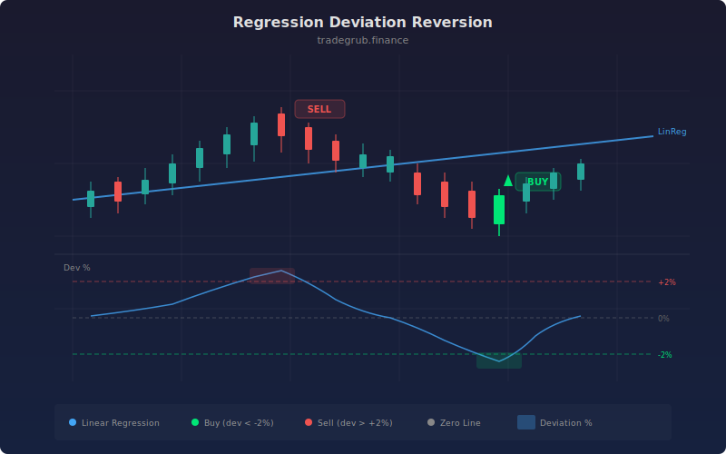

# Regression Deviation Reversion

Linear Regression Deviation Reversion is a statistical mean reversion strategy that measures how far price has drifted from its least-squares regression line, expressed as a percentage. Rooted in classical regression analysis, it treats the regression line as the market's "fair value" trajectory and trades the assumption that extreme deviations are temporary and will revert toward the trend.

## Conceptual Diagram



## How It Works

The strategy computes a linear regression of closing prices over a configurable lookback period using `ta.linreg(close, reg_length)`. This produces a best-fit line that captures the underlying trend direction and slope. The key metric is the percentage deviation: `((close - linreg) / linreg) * 100`.

When the deviation percentage crosses below the negative threshold (e.g., -2%), it means price has dropped significantly below where the regression model predicts it should be. The strategy enters long, betting on reversion upward. Conversely, when deviation crosses above the positive threshold, the strategy enters short.

Exit logic is symmetric: long positions close when deviation recovers above the negative exit level (default -0.5%), and short positions close when deviation drops below the positive exit level. This captures the bulk of the reversion move without waiting for a full overshoot in the opposite direction.

The percentage-based approach makes this strategy scale-independent. A 2% deviation means the same thing whether the stock trades at $5 or $500, eliminating the need to re-tune thresholds across different instruments.

## Parameters

| Parameter | Default | Range | Description |
|-----------|---------|-------|-------------|
| Regression Length | 50 | 10 - 200 | Lookback period for linear regression calculation |
| Deviation Threshold % | 2.0 | 0.5 - 10.0 | Percentage deviation from regression required for entry |
| Exit Deviation % | 0.5 | 0.0 - 5.0 | Percentage deviation level at which positions close |

## Python Advantage

Python enables clean vectorized percentage deviation computation across the entire price history in a single expression:

```python
# Linear regression computed over full array — no bar-by-bar loop
linreg = ta.linreg(close, reg_length)

# Vectorized percentage deviation — operates on entire numpy array at once
deviation_pct = ((close - linreg) / linreg) * 100

# Direct array indexing for crossover detection
if deviation_pct[-1] < -dev_threshold and deviation_pct[-2] >= -dev_threshold:
    strategy.entry("Long", strategy.LONG)
```

Pine cannot perform array-wide division and multiplication in a single expression. The `deviation_pct[-1]` and `deviation_pct[-2]` indexing for manual crossover detection is natural Python array slicing that would require separate `[]` history references in Pine.

## When to Use

Best suited for instruments with clear trending behavior where temporary deviations from the trend are common. Equities in established sectors, major forex pairs, and index ETFs tend to exhibit reliable regression reversion. Daily and 4-hour timeframes provide the cleanest signals. Avoid during earnings gaps or regime changes where the regression slope becomes invalid.

## Risk Management

Deviation thresholds should be calibrated to the instrument's typical volatility. A 2% threshold works for large-cap stocks but may be too tight for small-caps or crypto. Consider widening the exit deviation slightly above zero to avoid premature exits during choppy reversion. Place hard stops at 2x the deviation threshold to cap losses on trend breaks.

## Combining with Other Indicators

- **Z-Score Reversion** provides an alternative statistical normalization that can cross-confirm extreme readings.
- **Std Dev Channel** offers a visual channel representation of similar regression-based concepts.
- **RSI Mean Reversion** adds momentum confirmation to the statistical signal.
