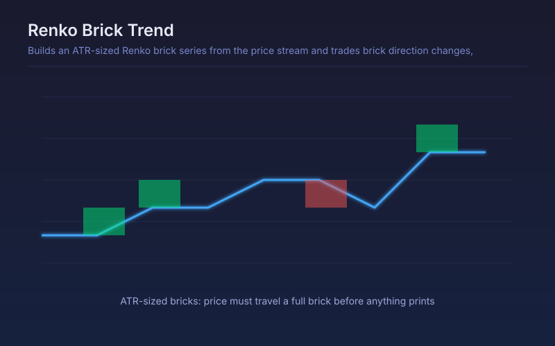

# Renko Brick Trend

Builds an ATR-sized Renko brick series from the price stream and trades brick direction changes, ignoring time entirely.

## Conceptual Diagram

## Parameters

| Parameter | Default | Range | Description |
|-----------|---------|-------|-------------|
| Brick size mode | ATR | ATR or Percent | Whether brick size adapts to volatility or stays a fixed percentage |
| ATR length | 14 | 5-100 | ATR length used when the mode is ATR |
| ATR multiple | 1.0 | 0.2-5.0 | Brick size as a multiple of ATR |
| Percent brick size | 1.0 | 0.1-10.0 | Brick size as a percentage of price when the mode is Percent |
| Bricks needed to flip | 2 | 1-5 | Consecutive same-direction bricks required before reversing the position |

## Signals

- Long: the brick series turns up and prints the required number of consecutive up bricks
- Short: the mirror case on the down side
- No signal at all while price moves less than one brick, however many bars pass
- The plotted brick level is the last completed brick, which doubles as a trailing reference

## Usage

Use where noise, not direction, is the problem: the brick filter removes small oscillations entirely. Requiring two or more bricks to flip cuts whipsaws sharply at the cost of entering later.
