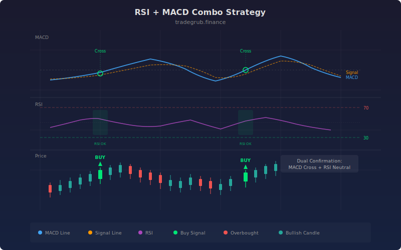

# RSI + MACD Combo

The RSI + MACD Combo is a dual-confirmation strategy that requires both a momentum oscillator (RSI) and a trend-following indicator (MACD) to agree before entering a trade. By filtering MACD crossover signals through RSI neutral-zone conditions, it avoids chasing extended moves and dramatically reduces false entries common with single-indicator approaches. This combination draws on the complementary strengths first described by Gerald Appel (MACD) and J. Welles Wilder (RSI).

## Conceptual Diagram



## How It Works

The strategy computes RSI over a configurable period and the MACD line, signal line, and histogram using fast/slow/signal EMA periods. It then waits for MACD bullish crossovers (MACD line crossing above the signal line) as the primary timing signal.

The RSI filter prevents entering when momentum is already at an extreme. A long entry requires the MACD bullish crossover to occur while RSI is between the oversold and overbought thresholds (not at either extreme). This ensures the trade has room to run. Short entries require a MACD bearish crossover with RSI similarly in the neutral zone.

The vectorized approach processes all bars simultaneously, iterating through the combined boolean condition array to fire entries at every qualifying bar. This makes backtesting across large datasets efficient and produces identical results regardless of data length.

The dual-filter approach means fewer trades overall, but each trade has confirmation from both a trend indicator and a momentum oscillator, resulting in higher win rates on trending instruments.

## Parameters

| Parameter | Default | Range | Description |
|-----------|---------|-------|-------------|
| RSI Length | 14 | 2 - 50 | Period for RSI calculation |
| RSI Overbought | 70 | 50 - 90 | Upper RSI threshold; longs blocked above this |
| RSI Oversold | 30 | 10 - 50 | Lower RSI threshold; shorts blocked below this |
| MACD Fast | 12 | 2 - 50 | Fast EMA period for MACD line |
| MACD Slow | 26 | 10 - 100 | Slow EMA period for MACD line |
| MACD Signal | 9 | 2 - 30 | Signal line smoothing period |

## Python Advantage

The strategy uses vectorized boolean array operations and a full-history iteration loop that Pine cannot express:

```python
# Vectorized compound conditions — boolean arrays combined with & operator
long_cond = (macd_bull_cross) & (rsi < rsi_ob) & (rsi > rsi_os)
short_cond = (macd_bear_cross) & (rsi > rsi_os) & (rsi < rsi_ob)

# Full-history iteration for backtesting all signals at once
for i in range(len(close)):
    if long_cond[i]:
        strategy.entry("Long", strategy.LONG)
    elif short_cond[i]:
        strategy.entry("Short", strategy.SHORT)
```

The `&` operator performs element-wise AND across numpy boolean arrays, producing a single condition array that is True only where all three conditions align simultaneously. Pine processes one bar at a time and cannot create or manipulate arrays of boolean conditions this way.

## When to Use

Best suited for trending markets on daily or 4-hour timeframes. Works well on liquid stocks and major forex pairs where MACD crossovers tend to be reliable. The RSI filter is especially valuable during extended trends, preventing entries when a move is already stretched.

## Risk Management

Since the strategy lacks explicit stop-loss logic, consider adding ATR-based stops manually. The absence of a built-in exit means positions rely on the opposite signal to close, which can result in extended drawdowns during strong trends that move against you. Size positions conservatively and consider adding a time-based exit for trades that stall.

## Combining with Other Indicators

- **Supertrend** provides a clear trend-direction filter that can prevent counter-trend MACD crossover entries.
- **Squeeze Momentum** confirms that volatility expansion is supporting the MACD crossover signal.
- **Triple Moving Average** adds a structural trend alignment check before allowing entries.
