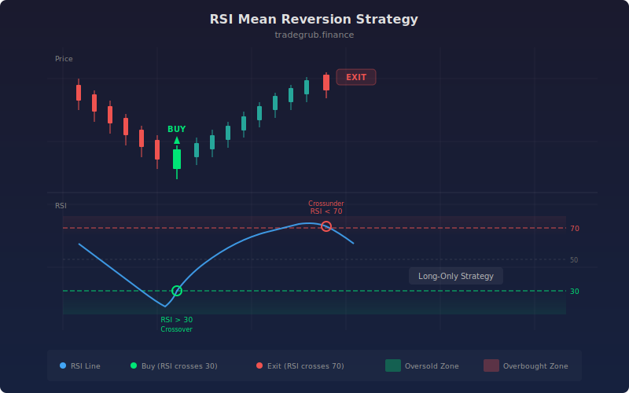

# RSI Mean Reversion

RSI Mean Reversion is a straightforward oscillator strategy that buys when the Relative Strength Index crosses above oversold territory and exits when it reaches overbought levels. Developed from J. Welles Wilder's original RSI framework introduced in 1978, this implementation distills the indicator down to its purest mean reversion application: buy weakness, sell strength.

## Conceptual Diagram



## How It Works

The strategy calculates RSI using the standard smoothed relative strength formula over a configurable period. RSI oscillates between 0 and 100, with readings below the oversold threshold indicating that recent losses have dominated gains (selling pressure is exhausting), and readings above the overbought threshold indicating recent gains have dominated losses (buying pressure is exhausting).

A long entry triggers when RSI crosses above the oversold level. The crossover (rather than the absolute level) is important: it means RSI was below the threshold and has begun recovering, signaling the start of a potential reversion move. The position closes when RSI crosses below the overbought level, indicating the upward reversion has reached an extreme that is likely to reverse.

This is a long-only strategy. It captures the reversion from oversold to overbought, which on equity markets aligns with the natural upward bias. The simplicity of the logic makes it an excellent baseline strategy for benchmarking more complex systems.

## Parameters

| Parameter | Default | Range | Description |
|-----------|---------|-------|-------------|
| RSI Length | 14 | 2 - 100 | Lookback period for RSI calculation |
| Oversold Level | 30 | 5 - 50 | RSI threshold below which crossovers trigger long entries |
| Overbought Level | 70 | 50 - 95 | RSI threshold below which crossunders close positions |

## Python Advantage

The entire strategy logic compresses into just a few lines thanks to vectorized crossover detection:

```python
rsi = ta.rsi(close, length)

# ta.crossover returns a full boolean array — no bar-by-bar loop needed
if ta.crossover(rsi, oversold):
    strategy.entry("Long", strategy.LONG)
if ta.crossunder(rsi, overbought):
    strategy.close("Long")
```

The `ta.crossover(rsi, oversold)` call compares the RSI array against a scalar threshold and returns a boolean array marking every crossover point across the entire dataset. Pine evaluates this one bar at a time and cannot batch-process historical crossovers into an array for further analysis.

## When to Use

RSI Mean Reversion works best on instruments with established ranges or mean-reverting behavior: large-cap stocks, index ETFs, and forex majors. Timeframes of 1 hour to daily are ideal. Avoid on strongly trending instruments where RSI can remain overbought or oversold for extended periods (the "RSI staying pinned" problem).

## Risk Management

The strategy has no built-in stop-loss. In strong downtrends, RSI can cross above oversold briefly before continuing lower, leading to significant drawdowns. Add ATR-based or percentage-based hard stops. Consider reducing the RSI length to make it more responsive, or raising the oversold threshold to require a stronger recovery before entry.

## Combining with Other Indicators

- **Bollinger Band Bounce** adds volatility-band confirmation to the RSI oversold signal.
- **VWAP Bounce** ensures entries align with institutional volume-weighted levels.
- **Triple Moving Average** filters entries to only occur when the broader trend supports the mean reversion direction.
