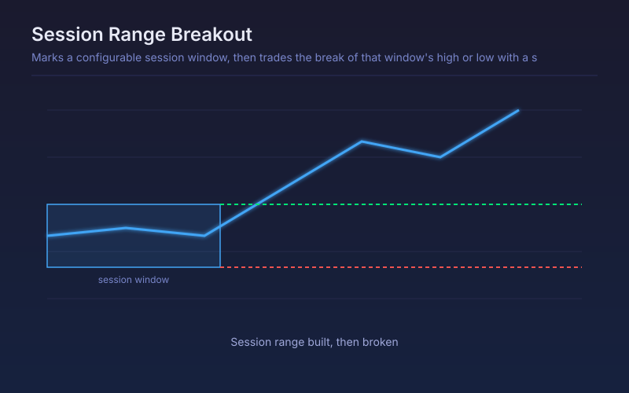

# Session Range Breakout

Marks a configurable session window, then trades the break of that window's high or low with a stop at the opposite edge.

## Conceptual Diagram

## Parameters

| Parameter | Default | Range | Description |
|-----------|---------|-------|-------------|
| Session start hour (UTC) | 0 | 0-23 | First hour of the range-building window |
| Session length (hours) | 3 | 1-12 | How long the window runs before breakouts are armed |
| Breakout buffer % | 0.05 | 0.0-1.0 | Distance beyond the edge required to trigger, filtering brushes |
| Stop at opposite edge | True | true/false | Close the position if price returns through the far edge |
| One trade per session | True | true/false | Ignore further signals once the session has traded |

## Signals

- Long: close above the session high plus the buffer, once the window has closed
- Short: close below the session low minus the buffer
- Exit: price trading back through the opposite edge of the session range
- The shaded band is the session range itself, which doubles as the day's reference structure

## Usage

Use on intraday timeframes where a defined session genuinely sets the day's structure: the Asian range before the London open, or the London range before the New York open. On daily bars the window collapses to a single bar and the strategy has nothing to work with.
