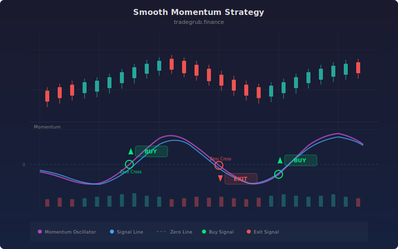

# Smooth Momentum Strategy

Zero-line crossover strategy that applies multiple stages of exponential smoothing to raw price momentum. Each smoothing pass reduces noise, producing a clean momentum curve that avoids the whipsaw common in single-pass momentum indicators. Entries require both a zero-line cross and positive slope confirmation, filtering out flat or ambiguous crossovers.

## Concept

## Parameters

- **Momentum Length**: Lookback for momentum (default: 14)
- **Smoothing Stages**: Number of smoothing passes (default: 3)
- **ATR Length**: ATR for stops (default: 14)
- **Stop/TP ATR Mult**: Risk management distances (default: 2.0/3.0)

## Signals

- **Long**: Smooth momentum crosses above zero with positive slope
- **Short**: Smooth momentum crosses below zero with negative slope
