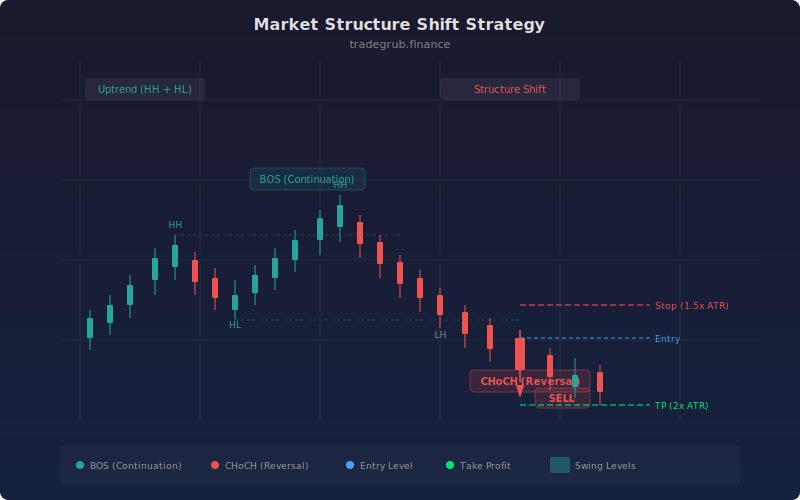

# Market Structure Shift

Market structure analysis tracks the sequence of swing highs and swing lows to determine trend direction and detect shifts. This strategy identifies two key events: Break of Structure (BOS), where price continues making higher highs or lower lows in the existing trend, and Change of Character (CHoCH), where price violates the prevailing structure to signal a potential reversal.

## Conceptual Diagram



## How It Works

The strategy scans each bar to determine if the current high equals the highest high over the swing length lookback period, or if the current low equals the lowest low. When a new swing high exceeds the previous swing high during an uptrend, that confirms a Break of Structure to the upside. When price instead breaks below the previous swing low during an uptrend, that registers as a Change of Character, signaling a potential reversal.

BOS events represent trend continuation. The strategy treats these as confirmation that the current directional bias remains valid. Entries on BOS signals follow the existing momentum.

CHoCH events represent structural breaks. These are higher-conviction reversal signals because they require the market to violate its established pattern of higher highs and higher lows (or lower highs and lower lows). The "CHoCH Entries Only" toggle restricts entries to these reversal signals for more selective trading.

## Parameters

| Name | Default | Range | Description |
|------|---------|-------|-------------|
| Swing Length | 5 | 2 - 20 | Lookback period for identifying swing highs and lows |
| ATR Length | 14 | 5 - 50 | Period for ATR calculation used in stop placement |
| ATR SL Multiplier | 1.5 | 0.5 - 5.0 | Multiplier applied to ATR for stop loss distance |
| TP Multiplier | 2.0 | 1.0 - 6.0 | Multiplier applied to stop distance for take profit |
| CHoCH Entries Only | False | True/False | When enabled, only Change of Character events trigger entries |
| Show Swing Levels | True | True/False | Display the tracked swing high and swing low levels on chart |

## Python Advantage

Vectorized swing detection runs across the full price history without per-bar overhead for the initial calculations:

```python
swing_high = ta.highest(high, swing_len)
swing_low = ta.lowest(low, swing_len)

# Precompute ATR for position sizing in a single pass
atr = ta.atr(atr_len)
```

The sequential loop handles state tracking (previous swing levels and trend direction), while all visualization calls operate on prebuilt boolean arrays.

## When to Use

This strategy works best on instruments with clear trending behavior and defined swing points. Higher timeframes (1H, 4H, Daily) produce more reliable structure signals because the swing points carry more significance. Ranging or choppy markets generate frequent false CHoCH signals as price repeatedly crosses swing levels without establishing directional momentum.

## Risk Management

Position sizing should account for the distance between entry and the most recent swing point, as that level represents the structural invalidation zone. The ATR multiplier parameters provide a volatility-adjusted alternative to fixed stop distances. Wider ATR multipliers reduce whipsaw exits but increase per-trade risk, so position size should scale inversely with stop distance.

## Combining with Other Indicators

- **Volume confirmation:** Filter BOS and CHoCH signals by requiring above-average volume on the breakout bar. Low-volume structure breaks are more likely to fail.
- **RSI divergence:** A CHoCH signal paired with RSI divergence (price making new highs while RSI makes lower highs) strengthens the reversal case.
- **Moving average alignment:** Use a 50 or 200 period SMA as a directional filter. Only take long BOS entries above the moving average and short BOS entries below it to stay aligned with the larger trend.
