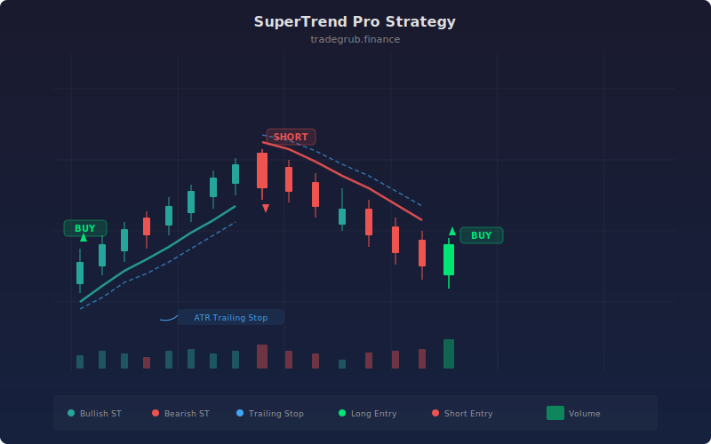

# SuperTrend Pro

SuperTrend Pro is an enhanced version of the classic Supertrend indicator that adds bidirectional trading (both long and short entries) and an optional ATR-based trailing stop for profit protection. While the standard Supertrend is long-only, this version captures moves in both directions and dynamically adjusts stop distances based on current volatility, making it particularly effective on volatile instruments.

## Conceptual Diagram



## How It Works

The strategy calculates the Supertrend indicator using ATR over a configurable period multiplied by a factor. When the direction value crosses above zero, the trend has flipped bullish, triggering a long entry. When direction crosses below zero, the trend has flipped bearish, triggering a short entry. This bidirectional approach means the strategy is always in the market during trending phases.

The key enhancement is the optional trailing stop. When enabled, the strategy calculates a trailing stop offset as `ATR * multiplier`, placing dynamic exits that adapt to current volatility. In bullish direction, the trailing stop follows the long position upward. In bearish direction, it follows the short position downward. This locks in profits during extended trends without exiting prematurely.

The Supertrend line is plotted with dynamic coloring: green when the direction is bullish, red when bearish. Triangle markers appear at each direction flip, providing clear visual signals on the chart.

## Parameters

| Parameter | Default | Range | Description |
|-----------|---------|-------|-------------|
| ATR Period | 10 | 1 - 100 | Period for ATR calculation used in Supertrend bands |
| Multiplier | 3.0 | 0.5 - 10.0 | ATR multiplier for band distance and trailing stop |
| Trailing Stop | True | on/off | Enables ATR-based trailing stop exits |

## Python Advantage

The strategy combines tuple unpacking, conditional trailing stop logic, and dynamic plot coloring:

```python
# Tuple unpacking for Supertrend values and direction
supertrend, direction = ta.supertrend(high, low, close, atr_period, multiplier)

# Conditional trailing stop — dynamic offset based on current ATR
if use_trailing:
    trail_offset = atr_val[-1] * multiplier
    if direction[-1] > 0:
        strategy.exit("Trail Long", "Long", trail_offset=trail_offset)
    else:
        strategy.exit("Trail Short", "Short", trail_offset=trail_offset)

# Dynamic color assignment via Python conditional expression
bull = direction[-1] > 0
plot(supertrend, title="SuperTrend",
     color="green" if bull else "red", linewidth=2)
```

Python's conditional expression (`"green" if bull else "red"`) directly controls plot appearance based on a runtime boolean. The trailing stop offset is computed from the ATR array using negative indexing, and the `use_trailing` boolean cleanly gates the entire trailing stop block.

## When to Use

SuperTrend Pro works best on volatile, trending instruments: cryptocurrencies, high-beta stocks, commodity futures, and momentum-driven forex pairs. The bidirectional approach captures both legs of trend changes. Timeframes from 15-minute to daily are effective. The trailing stop feature is especially valuable on higher timeframes where trends can extend for days or weeks.

## Risk Management

The trailing stop provides built-in risk management, but its effectiveness depends on the multiplier setting. A higher multiplier creates wider stops that give more room but risk larger losses per trade. A lower multiplier tightens stops but may trigger premature exits on normal pullbacks. During low-volatility periods, the ATR-based stop narrows automatically, providing tighter protection when the market is calm.

## Combining with Other Indicators

- **Multi-Period Supertrend** provides trend-direction confirmation from a slower Supertrend before following Pro signals.
- **Trend Volatility Combo** adds volume validation to Supertrend direction flips.
- **Squeeze Momentum** confirms that volatility expansion is genuine before the Supertrend flips direction.
