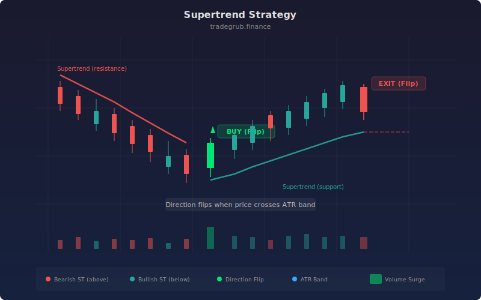

# Supertrend

Supertrend is a trend-following strategy built on ATR-based dynamic support and resistance bands. Developed by Olivier Seban, it creates a single trailing line that flips between acting as support (below price in uptrends) and resistance (above price in downtrends). Its simplicity and effectiveness have made it one of the most widely used trend indicators across all asset classes.

## Conceptual Diagram



## How It Works

The Supertrend indicator calculates an ATR value over a specified period, then multiplies it by a factor to create upper and lower bands around the median price (HL2). The key innovation is the trailing logic: in an uptrend, only the lower band is active and it can only move upward (never down), creating a rising support floor. In a downtrend, only the upper band is active and it can only move downward.

A direction flip occurs when price closes beyond the active band. When price crosses above the upper band, the direction flips to bullish (positive). When price crosses below the lower band, it flips bearish (negative). The strategy enters long on bullish flips and exits on bearish flips.

The factor parameter controls sensitivity. A higher factor creates wider bands that tolerate more pullback before flipping, resulting in fewer but later signals. A lower factor creates tighter bands that respond faster but generate more whipsaws. The ATR length determines how many bars of volatility history inform the band width.

## Parameters

| Parameter | Default | Range | Description |
|-----------|---------|-------|-------------|
| ATR Length | 10 | 1 - 100 | Period for ATR calculation used in band width |
| Factor | 3.0 | 0.5 - 10.0 | Multiplier applied to ATR for band distance from median price |

## Python Advantage

The strategy leverages the `ta.supertrend` function which returns both the trailing line and direction as separate arrays:

```python
# Supertrend returns tuple — clean Python unpacking
supertrend, direction = ta.supertrend(high, low, close, atr_length, factor)

# Direction crossover detection on full array
if ta.crossover(direction, 0)[-1]:
    strategy.entry("Long", strategy.LONG)
if ta.crossunder(direction, 0)[-1]:
    strategy.close("Long")
```

Python's tuple unpacking assigns both return values in a single line. The `direction` array contains positive values for bullish and negative for bearish, enabling simple crossover detection against zero. Pine's `supertrend()` function returns values via indexed plot references rather than clean variable assignment.

## When to Use

Supertrend excels on strongly trending instruments: crypto, futures, trending stocks, and momentum-driven forex pairs. It works on all timeframes from 5-minute scalping to weekly position trading. The strategy underperforms in choppy, range-bound markets where frequent direction flips generate whipsaw losses.

## Risk Management

The Supertrend line itself acts as a trailing stop, so the built-in risk management is inherent in the indicator. However, the distance between price and the Supertrend line can widen significantly during volatile moves, meaning the potential loss on a flip can be large. Consider position sizing based on the current ATR value, and add a maximum loss threshold for risk control.

## Combining with Other Indicators

- **Multi-Period Supertrend** adds a slower Supertrend as a trend-direction filter.
- **SuperTrend Pro** extends this with ATR trailing stops and bidirectional trading.
- **ADX Trend + RSI Momentum Filter** confirms the trend has genuine strength before following the Supertrend signal.
