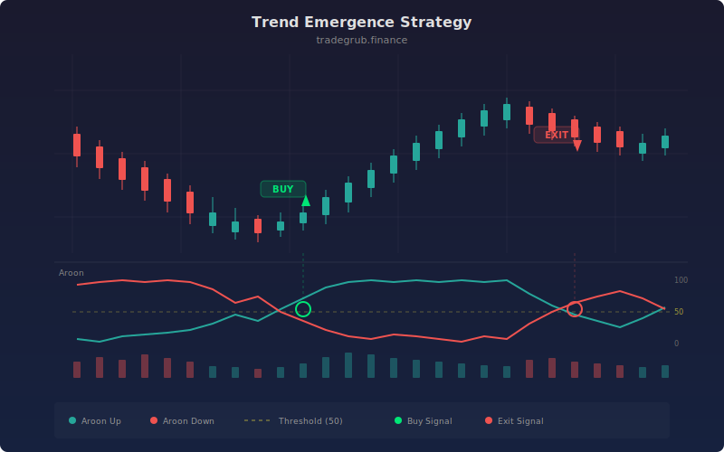

# Trend Emergence Strategy

Trend detection strategy built on the Aroon indicator, which measures how many bars since the highest high and lowest low within a lookback window. A trade triggers when Aroon Up (or Down) crosses above a configurable threshold and dominates the opposite line, signaling that a new trend is forming. ATR-based stops and take profit targets manage each position.

## Concept

## Parameters

- **Aroon Length**: Aroon indicator period (default: 25)
- **ATR Length**: ATR period for stops (default: 14)
- **Stop/TP ATR Mult**: Stop and take profit distances (default: 2.0/3.0)
- **Aroon Threshold**: Entry trigger level (default: 70)

## Signals

- **Long**: Aroon Up crosses above threshold and dominates Aroon Down
- **Short**: Aroon Down crosses above threshold and dominates Aroon Up
